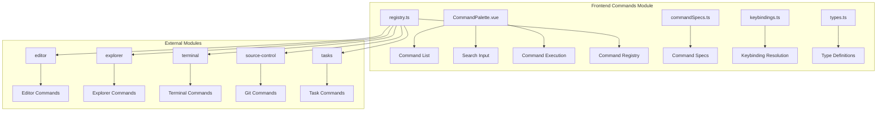

# 命令系统模块详细设计

## 架构设计

### 整体架构



### 数据流

1. **命令注册**: 各模块 → 命令规范 → 注册表
2. **命令过滤**: 用户输入 → 模糊搜索 → 命令列表
3. **命令执行**: 用户选择 → 权限检查 → 执行命令
4. **快捷键处理**: 键盘事件 → 快捷键匹配 → 命令执行

## 数据结构

### 命令定义

```typescript
type CommandId = "workbench.commandPalette.open" | "workbench.quickOpen.open" | ...

type CommandCategory = "editor" | "explorer" | "workbench" | "terminal" | "panel" | "settings" | "tasks" | "git"

interface CommandSpec {
  id: CommandId
  titleKey: string
  category: CommandCategory
  defaultKeybinding: string | null
  workspaceRequired?: boolean
}

interface CommandDefinition<Context extends CommandContext> {
  id: CommandId
  title: string
  category: CommandCategory
  defaultKeybinding: string | null
  when?: (context: Context) => boolean
  run: (context: Context) => void | Promise<void>
}
```

### 快捷键

```typescript
interface Keybinding {
  key: string
  modifiers: KeyModifier[]
  platform?: "mac" | "windows" | "linux"
}

type KeyModifier = "Mod" | "Shift" | "Alt" | "Ctrl"
```

### 命令上下文

```typescript
interface CommandContext {
  workspace: boolean
  activeTab: Tab | null
  activeTerminal: TerminalInstance | null
  activeEditor: EditorInstance | null
}
```

## 算法逻辑

### 命令注册

1. **规范收集**: 收集各模块的命令规范
2. **定义合并**: 合并命令定义
3. **冲突检测**: 检测 ID 冲突
4. **注册完成**: 完成注册

### 模糊搜索

1. **预处理**: 清理查询字符串
2. **评分算法**: 计算匹配分数
3. **排序**: 按分数排序
4. **过滤**: 过滤不可用的命令

### 快捷键解析

1. **平台检测**: 检测当前平台
2. **修饰键映射**: 映射修饰键
3. **冲突检测**: 检测快捷键冲突
4. **格式化**: 格式化显示

## 错误处理

### 命令错误

1. **ID 冲突**: 处理重复 ID
2. **定义缺失**: 处理缺失定义
3. **执行失败**: 处理执行异常

### 快捷键错误

1. **格式错误**: 处理格式错误
2. **平台不兼容**: 处理平台差异
3. **冲突**: 处理快捷键冲突

## 性能考虑

### 搜索优化

1. **索引**: 建立搜索索引
2. **缓存**: 缓存搜索结果
3. **防抖**: 输入防抖
4. **限制结果**: 限制结果数量

### 注册优化

1. **延迟注册**: 按需注册命令
2. **批量注册**: 合并注册操作
3. **内存优化**: 复用命令对象

## 测试策略

### 单元测试

1. **注册表测试**: 命令注册
2. **搜索算法测试**: 模糊搜索
3. **快捷键解析测试**: 解析逻辑

### 集成测试

1. **命令执行测试**: 真实命令
2. **快捷键绑定测试**: 键盘事件
3. **上下文检查测试**: 条件命令

### 组件测试

1. **面板渲染测试**: UI 组件
2. **搜索交互测试**: 输入、过滤
3. **命令选择测试**: 选择、执行

## 相关文件

- 前端: `src/modules/commands/`
- 平台: `@/lib/platform`
- 各模块命令规范