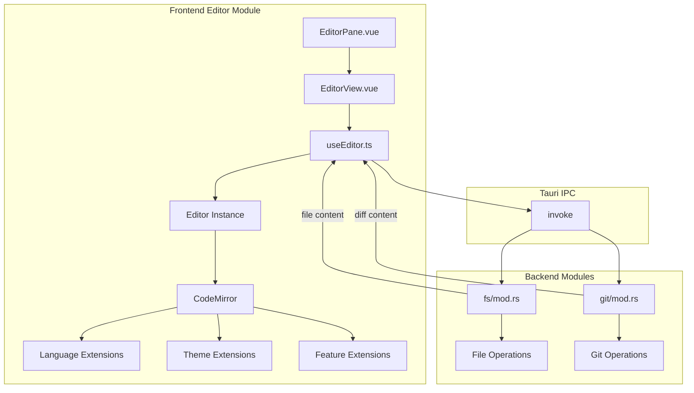

# 编辑器模块详细设计

## 架构设计

### 整体架构



### 数据流

1. **文件打开**: 文件路径 → fs_read_file → CodeMirror 状态
2. **文件保存**: CodeMirror 内容 → fs_write_file → 确认
3. **Diff 视图**: 文件路径 → git_diff_content → MergeView
4. **实时编辑**: 用户输入 → CodeMirror 更新 → 自动保存

## 数据结构

### CodeMirror 状态

```typescript
interface EditorState {
  doc: string
  selection: EditorSelection
  extensions: Extension[]
}

interface EditorInstance {
  view: EditorView
  state: EditorState
  config: EditorConfig
  filePath: string
  isDirty: boolean
}
```

### 语言配置

```typescript
interface LanguageConfig {
  name: string
  extensions: string[]
  parser: Language
  highlighter: HighlightStyle
  autocomplete: CompletionSource
}
```

### 主题配置

```typescript
interface ThemeConfig {
  name: string
  theme: Extension
  highlightStyle: HighlightStyle
}
```

## 算法逻辑

### 语言检测

1. **文件扩展名**: 根据扩展名匹配语言
2. **文件内容**: 分析内容特征（shebang、语法特征）
3. **用户配置**: 优先使用用户指定的语言

### 自动补全

1. **本地补全**: 基于当前文件内容
2. **语言补全**: 基于语言服务
3. **路径补全**: 文件路径补全
4. **片段补全**: 代码片段补全

### Diff 计算

1. **获取原始内容**: 从 Git 获取 HEAD 版本
2. **计算差异**: 使用 diff 算法比较
3. **生成视图**: 创建 MergeView 显示差异
4. **交互操作**: 支持接受/拒绝更改

## 错误处理

### 文件操作错误

1. **读取失败**: 文件不存在、权限不足、编码错误
2. **写入失败**: 权限不足、磁盘空间、文件锁定
3. **编码问题**: 自动检测编码、转换错误

### 编辑器错误

1. **语法错误**: 实时语法检查、错误标记
2. **内存不足**: 大文件处理、分块加载
3. **性能问题**: 大文件优化、延迟加载

## 性能考虑

### 大文件处理

1. **分块加载**: 只加载可见区域
2. **延迟解析**: 延迟语法解析
3. **虚拟滚动**: CodeMirror 内置虚拟化
4. **内存监控**: 监控编辑器内存使用

### 实时编辑

1. **防抖保存**: 用户停止输入后保存
2. **增量更新**: 只发送变化部分
3. **状态恢复**: 恢复光标位置和滚动位置
4. **历史管理**: 编辑历史和撤销/重做

## 测试策略

### 单元测试

1. **语言检测测试**: 文件扩展名、内容分析
2. **配置解析测试**: 编辑器设置、主题配置
3. **状态管理测试**: 编辑器状态、文件状态

### 集成测试

1. **文件操作测试**: 读取、保存、编码
2. **Git 集成测试**: Diff、提交、历史
3. **主题同步测试**: 应用主题、编辑器主题

### 组件测试

1. **EditorView 测试**: 渲染、交互
2. **useEditor 测试**: 状态管理、生命周期
3. **快捷键测试**: 绑定、执行

## 相关文件

- 前端: `src/modules/editor/`
- 后端: `src-tauri/src/modules/fs/`, `src-tauri/src/modules/git/`
- 配置: `src/modules/settings/`
- 样式: `src/styles/code-highlight.css`