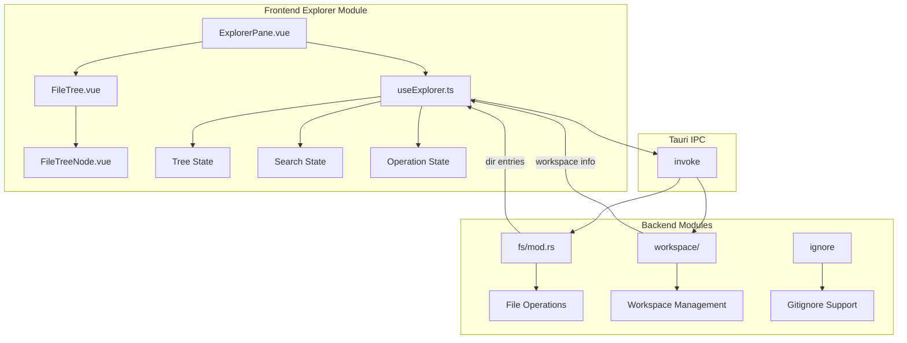

# 文件浏览器模块详细设计

## 架构设计

### 整体架构



### 数据流

1. **目录读取**: 路径 → fs_read_dir → 文件树更新
2. **文件操作**: 用户操作 → Tauri 命令 → 结果更新
3. **搜索**: 搜索词 → fs_search → 结果列表
4. **文件监控**: 文件变化 → Tauri 事件 → 树刷新

## 数据结构

### 文件树状态

```typescript
interface FileTreeNode {
  name: string
  path: string
  type: 'file' | 'directory'
  size?: number
  modified?: Date
  permissions?: string
  children?: FileTreeNode[]
  isExpanded?: boolean
  isLoading?: boolean
  error?: string
}

interface TreeState {
  root: string
  nodes: Map<string, FileTreeNode>
  expanded: Set<string>
  selected: string | null
  focused: string | null
}
```

### 搜索状态

```typescript
interface SearchResult {
  path: string
  name: string
  type: 'file' | 'directory'
  matches?: SearchMatch[]
}

interface SearchMatch {
  line: number
  column: number
  text: string
}

interface SearchState {
  query: string
  results: SearchResult[]
  isSearching: boolean
  currentResult: number
}
```

## 算法逻辑

### 文件树构建

1. **读取根目录**: 获取初始目录内容
2. **递归展开**: 按需加载子目录
3. **排序**: 按名称、类型、修改时间排序
4. **过滤**: 应用 .gitignore 和隐藏文件过滤

### 搜索算法

1. **文件名搜索**: 使用 glob 模式匹配
2. **内容搜索**: 使用 grep 搜索文件内容
3. **递归遍历**: 遍历目录树
4. **结果排序**: 按相关性排序

### 文件操作

1. **创建**: 验证路径、创建文件/目录、刷新树
2. **重命名**: 验证新路径、重命名、更新树
3. **删除**: 确认操作、删除、刷新树
4. **移动**: 验证目标、移动、刷新源和目标

## 错误处理

### 文件系统错误

1. **权限错误**: 检查读写权限、提示用户
2. **路径错误**: 验证路径有效性、处理符号链接
3. **并发错误**: 文件锁定、重试机制
4. **磁盘错误**: 空间不足、只读文件系统

### 操作错误

1. **创建失败**: 路径已存在、权限不足
2. **重命名失败**: 目标已存在、跨设备移动
3. **删除失败**: 目录非空、权限不足
4. **搜索失败**: 模式无效、超时

## 性能考虑

### 大目录处理

1. **虚拟滚动**: 只渲染可见节点
2. **懒加载**: 按需加载子目录
3. **缓存**: 缓存目录内容
4. **分页**: 大目录分页显示

### 搜索优化

1. **防抖输入**: 用户停止输入后搜索
2. **取消请求**: 新搜索取消旧请求
3. **结果限制**: 限制结果数量
4. **索引**: 使用文件索引加速搜索

## 测试策略

### 单元测试

1. **树构建测试**: 节点创建、排序、过滤
2. **搜索测试**: 模式匹配、结果排序
3. **操作测试**: 创建、重命名、删除

### 集成测试

1. **文件系统测试**: 真实文件操作
2. **工作区测试**: 多工作区支持
3. **监控测试**: 文件变化响应

### 组件测试

1. **FileTree 测试**: 渲染、交互
2. **useExplorer 测试**: 状态管理、生命周期
3. **搜索测试**: 输入、结果、导航

## 相关文件

- 前端: `src/modules/explorer/`
- 后端: `src-tauri/src/modules/fs/`, `src-tauri/src/modules/workspace/`
- 配置: `src/modules/settings/`