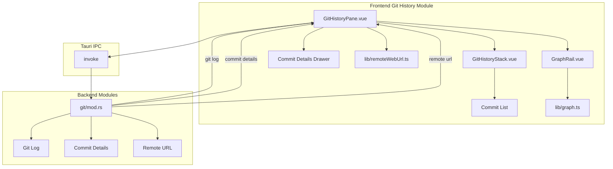

# Git 历史模块详细设计

## 架构设计

### 整体架构



### 数据流

1. **历史加载**: 分页加载提交历史
2. **图形渲染**: 计算分支图形布局
3. **详情查看**: 选择提交显示详情
4. **远程链接**: 解析远程仓库 URL

## 数据结构

### 提交信息

```typescript
interface GitCommit {
  sha: string
  shortSha: string
  subject: string
  author: string
  authorEmail: string
  authorDate: number
  committer: string
  committerEmail: string
  committerDate: number
  parents: string[]
  refs: string[]
}
```

### 图形数据

```typescript
interface GraphRow {
  sha: string
  lane: number
  nodeColor: LaneColor
  laneCount: number
  topEdges: GraphEdge[]
  bottomEdges: GraphEdge[]
}

interface GraphEdge {
  fromLane: number
  toLane: number
  color: LaneColor
}
```

### 远程信息

```typescript
interface RemoteWebInfo {
  host: RemoteWebHost
  hostname: string
  owner: string
  repo: string
  baseUrl: string
}

type RemoteWebHost = "github" | "gitlab" | "bitbucket" | "unknown"
```

## 算法逻辑

### 图形布局算法

1. **Lane 分配**: 为每个提交分配 lane
2. **颜色分配**: 为每个 lane 分配颜色
3. **边计算**: 计算提交之间的连接边
4. **交叉减少**: 优化布局减少边交叉

### 分页加载

1. **初始加载**: 加载第一页提交
2. **滚动加载**: 滚动到底部加载更多
3. **加载状态**: 显示加载进度
4. **错误处理**: 加载失败重试

### 远程 URL 解析

1. **URL 解析**: 解析 Git 远程 URL
2. **主机识别**: 识别 GitHub/GitLab/Bitbucket
3. **路径提取**: 提取 owner/repo 路径
4. **URL 生成**: 生成 Web 浏览 URL

## 错误处理

### Git 错误

1. **仓库无效**: 检测非 Git 仓库
2. **历史为空**: 空仓库处理
3. **网络错误**: 远程 URL 解析失败

### UI 错误

1. **渲染错误**: 图形渲染失败
2. **内存不足**: 大量提交处理
3. **性能问题**: 图形计算优化

## 性能考虑

### 图形渲染优化

1. **虚拟化**: 只渲染可见行
2. **缓存**: 缓存图形布局
3. **批量渲染**: 合并渲染操作
4. **Web Worker**: 后台计算布局

### 内存优化

1. **分页加载**: 避免加载全部历史
2. **对象池**: 复用图形对象
3. **垃圾回收**: 及时释放不用的对象

## 测试策略

### 单元测试

1. **图形算法测试**: 布局计算
2. **URL 解析测试**: 远程 URL 解析
3. **分页逻辑测试**: 加载更多

### 集成测试

1. **Git 命令测试**: 日志获取
2. **远程 URL 测试**: 真实仓库
3. **性能测试**: 大量提交

### 组件测试

1. **面板渲染测试**: UI 组件
2. **交互测试**: 滚动、选择
3. **详情抽屉测试**: 提交详情

## 相关文件

- 前端: `src/modules/git-history/`
- 后端: `src-tauri/src/modules/git/`
- 图标: `src/modules/explorer/lib/iconResolver`