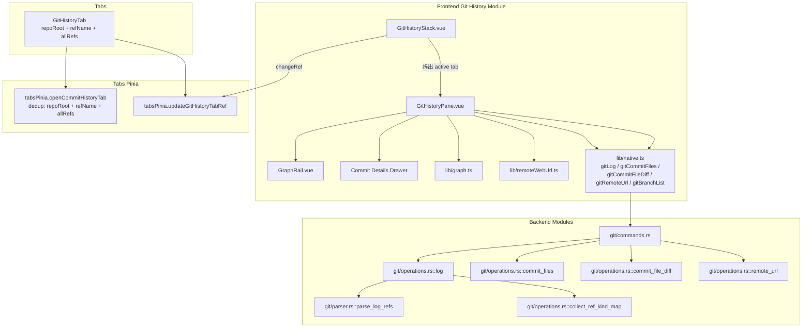

# Git 历史模块详细设计

## 架构设计

### 整体架构



### 数据流

1. **打开历史**: 命令面板 / 工具条 → `tabsPinia.openCommitHistoryTab({repoRoot, refName, allRefs})`；按 `(repoRoot, refName, allRefs)` dedup → 新建或激活 `GitHistoryTab`。
2. **加载第一页**: `GitHistoryPane.loadInitial` → `native.gitLog(repoRoot, {limit: 30, offset: 0, refName, all})` → 渲染 entries + 图形轨道 + ref 标签；`offset = PAGE_SIZE`，`hasMore = page.hasMore`。
3. **加载更多**: 点击 `Load more` → `loadMore` → 同上但 `offset` 累加；按 sha 去重避免重复请求。
4. **切换 ref**: `selectRef` → emit `changeRef({refName, allRefs})` → `GitHistoryStack.onChangeRef` → `tabsPinia.updateGitHistoryTabRef(tabId, ...)` → 标题、refName/allRefs 更新；Pane 自动重新 `loadInitial`（`watch([props.refName, props.allRefs])` 触发）。
5. **查看提交详情**: 点击提交行 → `selectCommit` → 抽屉打开 → `native.gitCommitFiles` 拉文件列表 → 点击文件 → emit `openCommitFile` → 上层开 `GitCommitFileDiffTab`。
6. **远程链接**: `loadRemote` → `native.gitRemoteUrl` → `parseRemoteWebUrl` → `RemoteWebInfo` → 抽屉底部 GitHub/GitLab/Bitbucket 跳转按钮。

## 数据结构

### 提交信息

```typescript
interface GitLogEntry {
  sha: string;
  shortSha: string;
  author: string;
  authorEmail: string;
  timestampSecs: number;
  parents: string[];
  subject: string;
  filesChanged: number;
  insertions: number;
  deletions: number;
  refs: GitLogRef[];
}
```

### 提交文件

```typescript
interface GitCommitFileChange {
  path: string;
  originalPath: string | null;
  status: string;
  statusLabel: string;
  added: number;
  removed: number;
  isBinary: boolean;
}
```

### 标签页身份与查询选项

```typescript
interface GitHistoryTab {
  id: number;
  kind: "git-history";
  title: string;
  repoRoot: string;
  refName: string | null;
  allRefs: boolean;
}

interface GitLogOptions {
  limit: number | null;
  offset: number | null;
  refName: string | null;
  all: boolean;
}
```

`allRefs=true` 时 `refName` 强制为 `null`（语义优先），dedup 因此更稳定。

### 分页响应

```typescript
interface GitLogPage {
  entries: GitLogEntry[];
  hasMore: boolean;
}
```

### ref 标签

```typescript
interface GitLogRef {
  name: string;
  kind: "head" | "local-branch" | "remote-branch" | "tag";
  isHead: boolean;
}
```

`head` 来自 `HEAD` 或 `HEAD -> <branch>`；`local-branch` 来自 `refs/heads/`；`remote-branch` 来自 `refs/remotes/<remote>/`；`tag` 来自 `refs/tags/`。

### 图形数据

```typescript
interface GraphRow {
  sha: string;
  lane: number;
  nodeColor: LaneColor;
  laneCount: number;
  topEdges: GraphEdge[];
  bottomEdges: GraphEdge[];
}

interface GraphEdge {
  fromLane: number;
  toLane: number;
  color: LaneColor;
}
```

### 远程信息

```typescript
interface RemoteWebInfo {
  host: RemoteWebHost;
  hostname: string;
  owner: string;
  repo: string;
  baseUrl: string;
}

type RemoteWebHost = "github" | "gitlab" | "bitbucket" | "unknown";
```

## 算法逻辑

### ref 范围与去重

1. `tabsPinia.openCommitHistoryTab` 收到 `{repoRoot, refName, allRefs}`；如果 `allRefs`，强制 `refName=null`。
2. 查找已有 tab：`repoRoot + refName + allRefs` 相同则激活。
3. `GitHistoryStack.paneKey = "${tab.id}-${refName ?? 'HEAD'}-${allRefs ? 'all' : 'single'}"`，确保切换 ref 时 Pane 重建而不是保留 stale 状态。
4. `GitHistoryPane` 监听 `[props.refName, props.allRefs]`，变化时重新 `loadInitial`。

### 图形布局算法

1. **Lane 分配**: 为每个提交分配 lane。
2. **颜色分配**: 为每个 lane 分配颜色。
3. **边计算**: 计算提交之间的连接边。
4. **交叉减少**: 优化布局减少边交叉。

### 分页加载

1. **初始加载**: `loadInitial` 拉第一页（`offset=0, limit=PAGE_SIZE`）。
2. **Load more**: `loadMore` 累加 `offset += PAGE_SIZE`；按 sha 去重（前端 `seen` Set）避免重发请求造成的重复。
3. **结束探测**: 后端 `--max-count = limit + 1`；返回条数 `> limit` 时 `hasMore=true` 并截断到 `limit`。
4. **错误处理**: 失败回退到错误状态 + "Retry" 按钮。

### ref 解析（Rust 端）

1. `git log --decorate=short --format=<LOG_FORMAT>` 抓原始 decorate 字段。
2. `collect_ref_kind_map` 用 `git for-each-ref refs/heads refs/remotes refs/tags` 构造 short name → kind 的查找表，避免短名歧义。
3. `parse_log_refs` 解析逗号分隔的 decorate token，处理 `tag: ...` / `HEAD` / `HEAD -> <branch>` 三种特殊 token。
4. 优先级按 git 自身：`refs/heads` 先于 `refs/remotes` 先于 `refs/tags`，短名冲突时本地压过远端。

### 远程 URL 解析

1. **URL 解析**: 解析 Git 远程 URL（SSH 与 HTTPS）。
2. **主机识别**: 识别 GitHub / GitLab / Bitbucket / unknown。
3. **路径提取**: 提取 owner/repo 路径。
4. **URL 生成**: 生成 Web 浏览 URL（commit 详情时拼 SHA）。

## 错误处理

### Git 错误

1. **仓库无效**: 后端 `authorized_repo_root` 拒绝 → Rust 抛 `command("git log", ...)`。
2. **历史为空**: `does not have any commits yet` / `bad default revision` / `unknown revision` / `ambiguous argument 'head'` → Rust 返回 `empty_log_page()`；前端用 "No commits yet" 占位。
3. **指定 ref 不存在**: Rust 区分 "unknown revision" 时返回 "ref not found: <refName>" 错误。
4. **ref 名称非法**: `validate_log_ref_name` 拦截空名 / `-` 开头 / 含控制字符 / 含 `\0`。

### UI 错误

1. **渲染错误**: 图形渲染失败 → 单元测试覆盖。
2. **内存不足**: 大量提交 → 分页 + 虚拟化。
3. **性能问题**: 图形计算在主线程，单页 30 条可控。

## 性能考虑

### 图形渲染优化

1. **Lane 缓存**: `GraphRow` 由 `lib/graph.ts` 在 `computed` 中按 `commits` 增量重算。
2. **每行固定高度**: `ROW_HEIGHT = 32` 让浏览器跳过 layout 重排。
3. **批量渲染**: 单次 `for` 生成虚拟列表节点（当前 pane 使用普通 `overflow-auto` 渲染，受分页限制条目数）。

### 内存优化

1. **分页加载**: 避免一次性加载全部历史。
2. **去重**: `loadMore` 按 sha 去重避免重复条目。
3. **filesBySha 缓存**: 提交文件列表只在第一次查看时拉取，后续查看直接复用。
4. **请求单飞**: `logRequestId` 防止过期响应覆盖。

## 测试策略

### 单元测试

- `GitHistoryPane.vue.test.ts`：ref 切换、分页、远程链接、提交详情流程、空仓、无效 ref、ref 标签渲染。
- `GitHistoryStack.vue.test.ts`：tabs -> pane 路由、changeRef 事件向上传。
- `gitHistoryVueBoundary.test.ts`：不允许 React 残留。
- 后端 `operations.rs::log` 单测：
  - `log_default_returns_page_with_entries`
  - `log_ref_name_limits_to_branch`
  - `log_all_includes_refs_outside_current_head`
  - `log_classifies_refs_as_head_local_remote_tag`
  - `log_offset_paginates_without_duplicates`
  - `log_has_more_false_when_last_page_reached`
  - `log_invalid_ref_is_rejected`
  - `log_empty_repo_returns_empty_page_without_has_more`

### 集成测试

- `native.test.ts::gitLog`：覆盖 `limit` / `offset` / `refName` / `all` / `WorkspaceEnv` 透传。

### 组件测试

- `GitHistoryPane.vue`：ref 选择器、提交行点击、抽屉打开、远程 URL 渲染。
- `GitHistoryStack.vue`：active tab 切换、ref 变更事件。

## 相关文件

- 前端: `src/modules/git-history/`
- 后端: `src-tauri/src/modules/git/`（commands / operations / parser / types）
- 图标: `src/modules/explorer/lib/iconResolver`
- Tabs: `src/modules/tabs/tabsPinia.ts` (`openCommitHistoryTab` / `updateGitHistoryTabRef`)
- Tauri IPC 出口: `src/lib/native.ts`