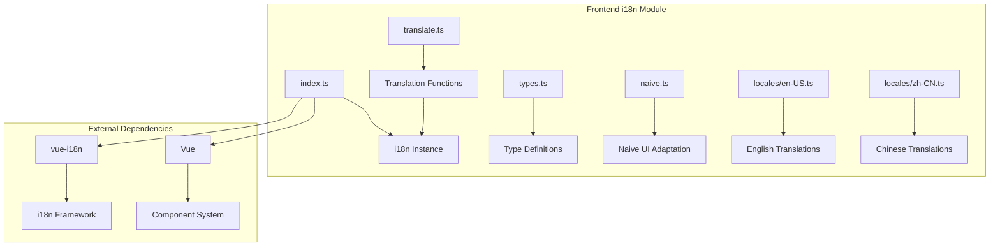

# 国际化模块详细设计

## 架构设计

### 整体架构



### 数据流

1. **初始化**: 语言偏好 → 加载翻译 → 创建 i18n 实例
2. **翻译**: 键值 → 查找翻译 → 返回文本
3. **语言切换**: 用户选择 → 加载翻译 → 更新实例
4. **系统检测**: 系统语言 → 匹配语言 → 应用

## 数据结构

### 语言类型

```typescript
type LanguagePref = "system" | "zh-CN" | "en-US"
type AppLocale = "zh-CN" | "en-US"

interface LanguageConfig {
  label: string
  value: AppLocale
  systemMatch: string[]
}
```

### 翻译文件

```typescript
interface TranslationFile {
  locale: AppLocale
  messages: Record<string, string | Record<string, string>>
}
```

### 翻译函数

```typescript
type TranslateFunction = (key: string, params?: Record<string, unknown>) => string
```

## 算法逻辑

### 语言检测

1. **系统语言获取**: 获取系统语言列表
2. **语言匹配**: 匹配支持的语言
3. **默认语言**: 使用默认语言
4. **语言验证**: 验证语言有效性

### 翻译加载

1. **动态导入**: 动态导入翻译文件
2. **缓存**: 缓存翻译文件
3. **合并**: 合并翻译消息
4. **验证**: 验证翻译完整性

### 翻译查找

1. **键值解析**: 解析键值路径
2. **参数替换**: 替换参数占位符
3. **复数处理**: 处理复数形式
4. **回退**: 回退到默认语言

## 错误处理

### 翻译错误

1. **键值缺失**: 处理缺失的键值
2. **文件加载失败**: 处理加载失败
3. **格式错误**: 处理格式错误
4. **编码错误**: 处理编码问题

### 语言错误

1. **不支持的语言**: 处理不支持的语言
2. **检测失败**: 处理检测失败
3. **切换失败**: 处理切换失败

## 性能考虑

### 加载优化

1. **按需加载**: 按需加载翻译文件
2. **预加载**: 预加载常用翻译
3. **缓存**: 缓存翻译结果
4. **压缩**: 压缩翻译文件

### 查找优化

1. **索引**: 建立翻译索引
2. **缓存**: 缓存查找结果
3. **批量查找**: 批量查找翻译
4. **懒翻译**: 按需翻译

## 测试策略

### 单元测试

1. **语言检测测试**: 检测逻辑
2. **翻译查找测试**: 查找逻辑
3. **参数替换测试**: 替换逻辑

### 集成测试

1. **vue-i18n 集成测试**: 框架集成
2. **Naive UI 集成测试**: UI 适配
3. **动态加载测试**: 翻译加载

### 组件测试

1. **翻译显示测试**: 文本显示
2. **语言切换测试**: 切换功能
3. **响应式测试**: 语言变化响应

## 相关文件

- 前端: `src/modules/i18n/`
- 框架: `vue-i18n`
- UI: `naive-ui`