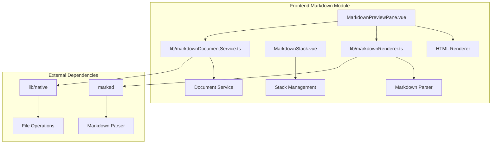

# Markdown 模块详细设计

## 架构设计

### 整体架构



### 数据流

1. **文件打开**: 文件路径 → 读取文件 → 解析 Markdown
2. **渲染**: Markdown 文本 → HTML 转换 → 显示
3. **更新**: 文件变化 → 重新读取 → 重新渲染

## 数据结构

### 文档状态

```typescript
type MarkdownDocumentState =
  | { status: "loading" }
  | { status: "ready"; content: string; size: number }
  | { status: "binary"; size: number }
  | { status: "toolarge"; size: number; limit: number }
  | { status: "error"; message: string }
```

### 渲染配置

```typescript
interface MarkdownRenderConfig {
  allowedSchemes: string[]
  blockedSchemes: string[]
  imageLoading: "lazy" | "eager"
  linkTarget: string
}
```

### 渲染结果

```typescript
interface MarkdownRenderResult {
  html: string
  toc: TocEntry[]
  wordCount: number
  readingTime: number
}
```

## 算法逻辑

### Markdown 解析

1. **词法分析**: 分析 Markdown 语法
2. **语法树构建**: 构建语法树
3. **HTML 生成**: 生成 HTML
4. **安全过滤**: 过滤危险内容

### 安全处理

1. **协议过滤**: 过滤危险协议
2. **XSS 防护**: 防止 XSS 攻击
3. **链接安全**: 处理外部链接
4. **图片安全**: 处理图片加载

### 文档服务

1. **文件读取**: 读取 Markdown 文件
2. **编码检测**: 检测文件编码
3. **大小检查**: 检查文件大小
4. **缓存管理**: 管理文档缓存

## 错误处理

### 解析错误

1. **语法错误**: 处理语法错误
2. **编码错误**: 处理编码错误
3. **格式错误**: 处理格式错误
4. **内存错误**: 处理内存错误

### 渲染错误

1. **HTML 生成错误**: 处理生成错误
2. **安全过滤错误**: 处理过滤错误
3. **显示错误**: 处理显示错误

## 性能考虑

### 解析优化

1. **增量解析**: 只解析变化的部分
2. **缓存**: 缓存解析结果
3. **异步解析**: 非阻塞解析
4. **流式解析**: 流式处理大文件

### 渲染优化

1. **虚拟滚动**: 大量内容使用虚拟滚动
2. **懒渲染**: 按需渲染内容
3. **缓存**: 缓存渲染结果
4. **压缩**: 压缩 HTML 输出

## 测试策略

### 单元测试

1. **解析测试**: Markdown 解析
2. **安全测试**: 安全过滤
3. **渲染测试**: HTML 生成

### 集成测试

1. **文件读取测试**: 真实文件
2. **marked 集成测试**: 解析器集成
3. **安全测试**: 安全场景

### 组件测试

1. **面板渲染测试**: UI 组件
2. **交互测试**: 滚动、缩放
3. **响应式测试**: 文件变化响应

## 相关文件

- 前端: `src/modules/markdown/`
- 解析器: `marked`
- 文件操作: `@/lib/native`