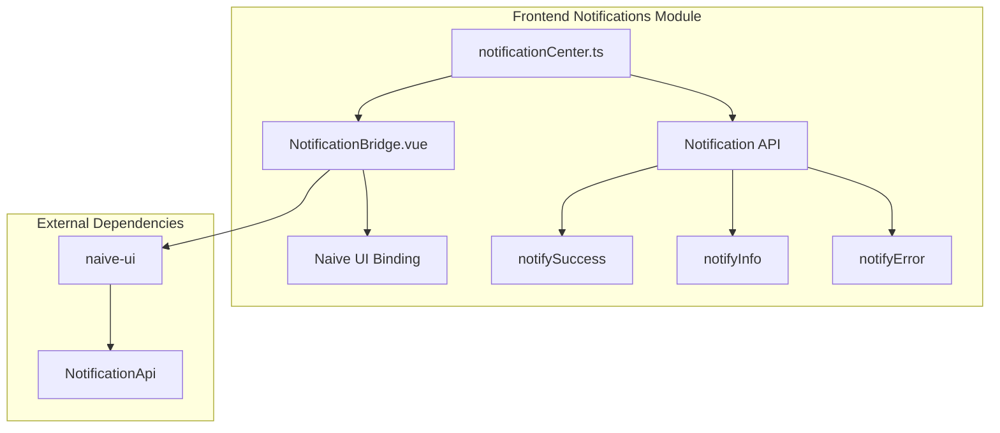

# 通知模块详细设计

## 架构设计

### 整体架构



### 数据流

1. **通知触发**: 业务逻辑 → 通知函数 → 显示通知
2. **通知管理**: 创建通知 → 管理生命周期 → 自动关闭
3. **用户交互**: 用户操作 → 关闭通知 → 清理资源

## 数据结构

### 通知类型

```typescript
type NotificationType = "success" | "info" | "warning" | "error"

interface NotificationOptions {
  title: string
  content?: string | null
  type: NotificationType
  duration?: number
  closable?: boolean
}
```

### 通知配置

```typescript
interface NotificationConfig {
  successDuration: number
  infoDuration: number
  errorDuration: number
  keepOnHover: boolean
}
```

## 算法逻辑

### 通知创建

1. **参数验证**: 验证通知参数
2. **类型确定**: 确定通知类型
3. **配置应用**: 应用默认配置
4. **创建通知**: 调用 Naive UI API

### 生命周期管理

1. **创建**: 创建通知实例
2. **显示**: 显示通知
3. **自动关闭**: 定时关闭
4. **手动关闭**: 用户关闭
5. **清理**: 清理资源

### 用户交互

1. **悬停暂停**: 鼠标悬停暂停关闭
2. **移出恢复**: 鼠标移出恢复关闭
3. **点击关闭**: 点击关闭按钮
4. **批量关闭**: 关闭所有通知

## 错误处理

### 通知错误

1. **API 不可用**: 处理 API 不可用
2. **创建失败**: 处理创建失败
3. **显示失败**: 处理显示失败

### 配置错误

1. **无效配置**: 处理无效配置
2. **类型错误**: 处理类型错误
3. **参数缺失**: 处理参数缺失

## 性能考虑

### 创建优化

1. **批量创建**: 合并多个创建操作
2. **复用实例**: 复用通知实例
3. **延迟创建**: 按需创建
4. **限制数量**: 限制同时显示数量

### 生命周期优化

1. **自动清理**: 自动清理过期通知
2. **内存管理**: 管理通知内存
3. **事件处理**: 优化事件处理
4. **渲染优化**: 优化渲染性能

## 测试策略

### 单元测试

1. **通知创建测试**: 创建逻辑
2. **生命周期测试**: 生命周期管理
3. **配置测试**: 配置应用

### 集成测试

1. **Naive UI 集成测试**: API 调用
2. **用户交互测试**: 交互逻辑
3. **批量操作测试**: 批量通知

### 组件测试

1. **桥接组件测试**: UI 组件
2. **通知显示测试**: 显示效果
3. **响应式测试**: 交互响应

## 相关文件

- 前端: `src/modules/notifications/`
- UI: `naive-ui`