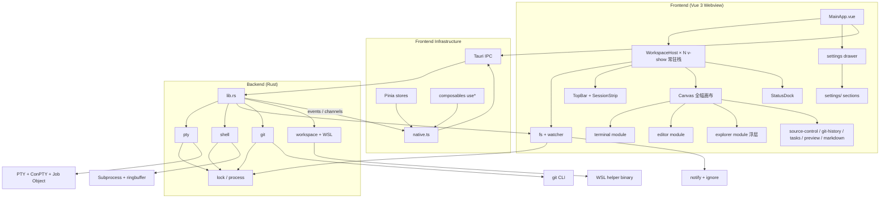
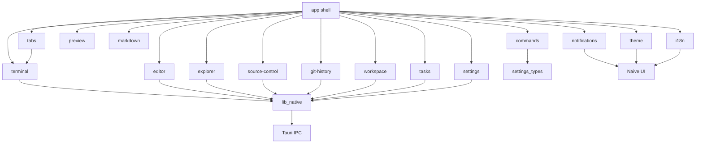
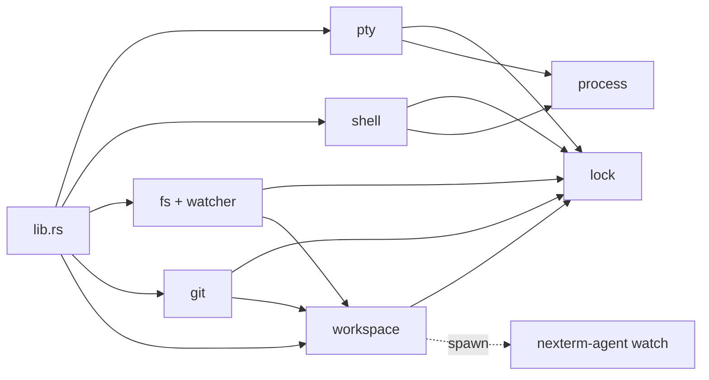

# Nexterm 系统架构总览

> 本文件是 docs/architecture 的入口导读之一。完整阅读路径见 `docs/architecture/README.md`。

## 概述

Nexterm 是一个基于 Tauri 2 的终端开发环境，采用 Rust 后端和 Vue 3 前端架构，定位是"单窗口集成开发工作台"：终端、文件浏览、代码编辑、Git、任务、预览、Markdown 全部在同一个原生窗口内。

## 技术栈

| 层级 | 技术 | 版本 |
|------|------|------|
| 桌面框架 | Tauri | 2.x |
| 后端语言 | Rust | 2021 edition |
| 前端框架 | Vue | 3.5+ |
| 前端语言 | TypeScript | 5.8+（`moduleResolution: bundler`，`target: ES2020`） |
| UI 组件库 | Naive UI | 2.x（主题由 `NConfigProvider` + `themeOverrides` 覆盖） |
| 终端渲染 | xterm.js | 6.x（fit/search/serialize/web-links/webgl addon） |
| 代码编辑器 | CodeMirror | 6.x（含 merge、lint、vim 模式与多语言包） |
| 状态管理 | Pinia | 3.x（setup-function 模式，无 `this.*`） |
| 路由 | vue-router | 5.x |
| 样式 | Tailwind CSS | 4.x（仅布局/精细样式，不参与组件主题） |
| 构建工具 | Vite | 7.x（端口 3180，manualChunks 分 xterm/codemirror/vue-vendor） |
| 包管理器 | pnpm | workspace 模式 |

## 总体架构图

## 模块依赖

### 前端模块依赖

模块之间**只通过以下三种方式通信**：

1. **共享 Pinia store**：跨模块读状态（如 `preferencesPinia` 被 `commands` / `settings` / `editor` 共享）。
2. **直接 composable 调用**：一个模块的 composable 被另一个模块的组件挂载时使用。
3. **Tauri 事件总线**：`nexterm://workspace-fs-changed` 等用于跨模块广播后端事件。

禁止在 store 内部订阅事件总线、禁止 store-to-store 直接互相 import 状态。

### 后端模块依赖

`lock.rs` 是所有 `Mutex` / `RwLock` 的统一入口；`process.rs` 在 Windows 下隐藏子进程控制台窗口并提供共享的限流排水/超时击杀助手；`workspace/` 目录（mod/registry/env/wsl）是 fs/pty/shell/git 的授权与路径中枢。

## 数据流

### 前端到后端

1. 用户操作触发 Vue 组件方法（或者 Pinia store action）。
2. Store / composable 通过 `@/lib/native` 封装好的 `invoke()` 调用对应 Tauri 命令，并把 `workspace`（`WorkspaceEnv`）一并透传。
3. Tauri IPC 路由到 Rust 命令处理器。
4. Rust 命令先过 `WorkspaceRegistry.authorize_*`，再执行业务。
5. 结果以 `Result<T, String>` 返回；`Ok` 直接 resolve，`Err` 走 reject。

### 后端到前端

- **PTY 输出**：通过 Tauri `Channel<Response>` 流式推送，xterm.js 端 `Channel.onmessage` 接收 chunk。
- **文件变化**：`fs_watch_workspace` 发出 `nexterm://workspace-fs-changed` 事件，前端 `native.onWorkspaceFsChanged` 解码。
- **深链 / CLI 启动**：`nexterm://deep-link-open` 事件，前端 `native.onDeepLinkOpen` 订阅。
- **后台进程日志**：`shell_bg_spawn` 后通过 `shell_bg_logs(handle, offset)` 增量拉取；不使用推送。

## 关键设计决策

1. **Rust 后端独占系统访问**：所有 fs/pty/shell/git 路径都必须过 `WorkspaceRegistry.authorize_*`，防止 webview 直连敏感资源。
2. **模块化前端**：21 个领域模块自治，跨模块通信走 store/composable/事件总线三种白名单通道。
3. **事件驱动**：PTY 用 `Channel`，其他用 `EventBus`；不引入 store-to-store 直接订阅。
4. **Pinia 状态管理**：setup-function 模式强制，单一 `preferencesPinia` 维护所有偏好。
5. **统一路径处理**：边界处归一化 `\\` 与 `/`，WSL 转换集中在 `workspace/wsl.rs`。
6. **ConPTY 序列化保护**：Windows 上 `pty_open` 通过互斥避免首屏输出管道卡住。
7. **Job Object**：所有 Windows shell 子进程必须挂 Job Object，不允许在无替代方案时移除。
8. **WSL agent**：`nexterm-agent` 独立二进制（fs/git/watch），避免 webview 进程阻塞。

## 文档地图

- `01-overview.md` -- 本文件（与 README.md 同义但更系统）
- `02-module-contracts.md` -- 模块间通信、Pinia 写法、命名规范
- `03-development-workflow.md` -- 开发/调试/提交/新增模块
- `04-security-model.md` -- WorkspaceRegistry、Job Object、Transcript、ConPTY 序列化
- `05-glossary.md` -- 术语表
- `<module>/README.md` -- 各模块概览
- `<module>/detailed-design.md` -- 各模块详细设计
