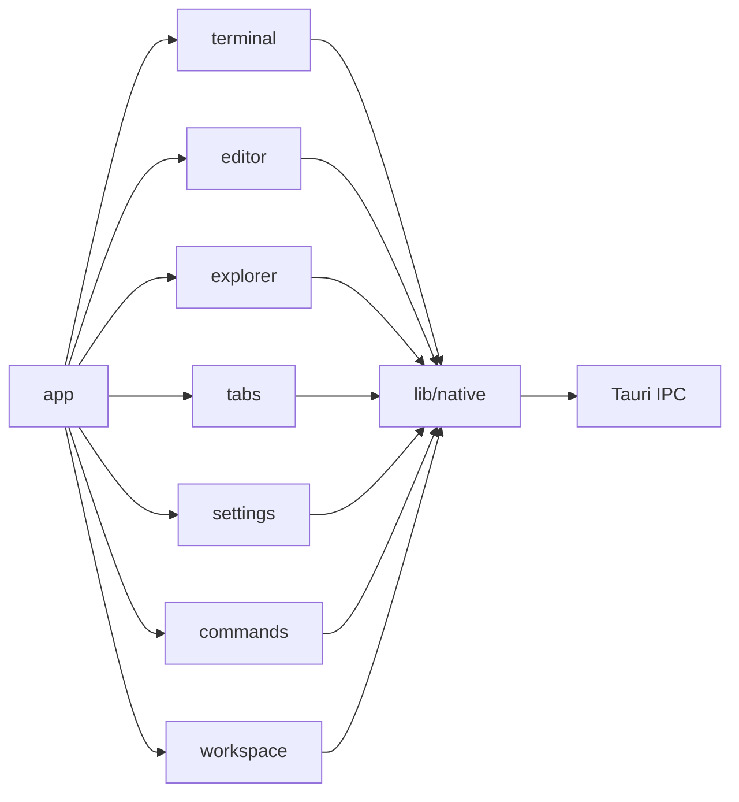
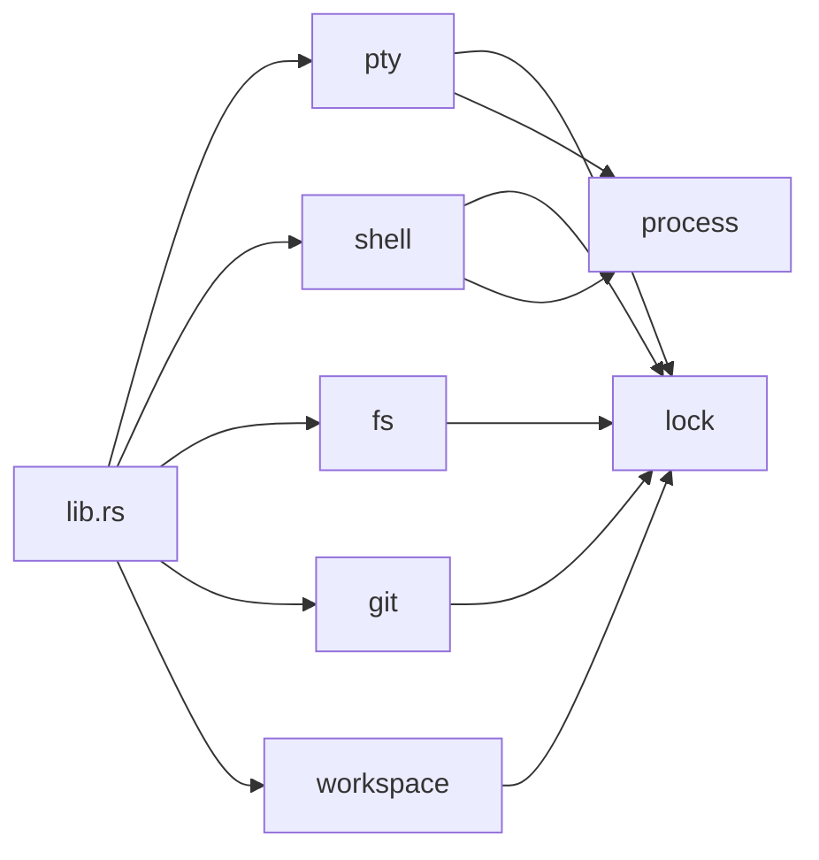

# Nexterm 系统架构总览

## 概述

Nexterm 是一个基于 Tauri 2 的终端开发环境，采用 Rust 后端和 Vue 3 前端架构。

## 技术栈

| 层级 | 技术 | 版本 |
|------|------|------|
| 桌面框架 | Tauri | 2.x |
| 后端语言 | Rust | 2021 edition |
| 前端框架 | Vue | 3.x |
| UI组件库 | Naive UI | latest |
| 终端渲染 | xterm.js | 6.x |
| 代码编辑器 | CodeMirror | 6.x |
| 状态管理 | Pinia | 3.x |
| 构建工具 | Vite | 7.x |
| 包管理器 | pnpm | latest |

## 系统架构图

```mermaid
graph TB
    subgraph "Frontend (Vue 3 Webview)"
        A[MainApp.vue] --> B[WorkspaceShell]
        B --> C[TabBar]
        B --> D[PaneStack]
        D --> E[Terminal Module]
        D --> F[Editor Module]
        D --> G[Explorer Module]
        D --> H[Other Modules]
    end
    
    subgraph "Backend (Rust)"
        I[lib.rs] --> J[PTY Module]
        I --> K[Shell Module]
        I --> L[FS Module]
        I --> M[Git Module]
        I --> N[Workspace Module]
    end
    
    subgraph "System"
        O[File System]
        P[Processes]
        Q[Git]
        R[WSL]
    end
    
    A -->|Tauri invoke()| I
    J --> P
    K --> P
    L --> O
    M --> Q
    N --> R
    
    I -->|Events| A
```

## 模块关系

### 前端模块依赖



### 后端模块依赖



## 数据流

### 前端到后端

1. 用户操作触发 Vue 组件方法
2. 组件调用 Pinia store action
3. Store 使用 `native.ts` 封装的 Tauri invoke 调用
4. Tauri IPC 将调用路由到 Rust 后端
5. Rust 命令处理请求并返回结果

### 后端到前端

1. Rust 模块产生事件（文件变化、PTY输出等）
2. 通过 Tauri 事件总线发送到前端
3. 前端监听事件并更新状态
4. Vue 响应式系统自动更新UI

## 关键设计决策

1. **Rust 后端所有权**: 所有系统访问通过 Rust 后端，确保安全性
2. **模块化架构**: 前后端都采用模块化设计，便于维护和扩展
3. **事件驱动**: 使用 Tauri 事件总线进行异步通信
4. **状态管理**: 使用 Pinia 进行前端状态管理
5. **路径处理**: 统一处理 Windows/Unix/WSL 路径差异

## 相关文档

- [终端模块](./terminal/README.md)
- [编辑器模块](./editor/README.md)
- [文件浏览器模块](./explorer/README.md)
- [源代码控制模块](./source-control/README.md)
- [Git历史模块](./git-history/README.md)
- [标签页管理模块](./tabs/README.md)
- [任务管理模块](./tasks/README.md)
- [设置模块](./settings/README.md)
- [命令系统模块](./commands/README.md)
- [工作区模块](./workspace/README.md)
- [主题模块](./theme/README.md)
- [通知模块](./notifications/README.md)
- [国际化模块](./i18n/README.md)
- [预览模块](./preview/README.md)
- [Markdown模块](./markdown/README.md)
- [Pinia状态管理](./pinia/README.md)