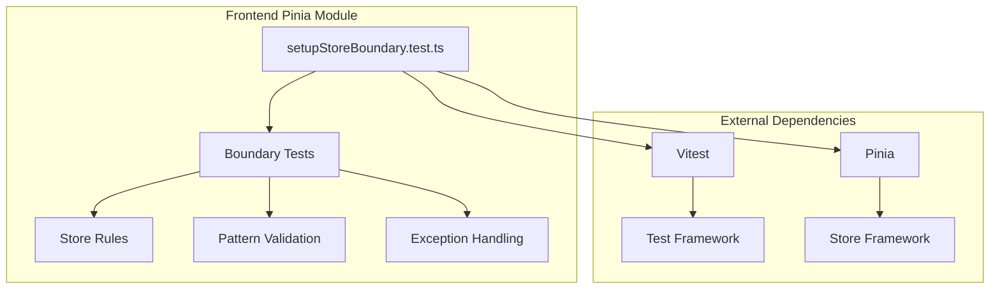

# Pinia 状态管理模块详细设计

## 架构设计

### 整体架构



### 数据流

1. **测试执行**: 运行测试 → 扫描文件 → 验证规则
2. **规则检查**: 检查 store 模式 → 验证 API 使用 → 报告问题
3. **异常处理**: 识别例外 → 允许例外 → 记录原因

## 数据结构

### 测试规则

```typescript
interface StoreRule {
  id: string
  name: string
  description: string
  severity: "error" | "warning"
  check: (file: string, content: string) => RuleResult
}

interface RuleResult {
  pass: boolean
  message?: string
  line?: number
  column?: number
}
```

### 测试配置

```typescript
interface TestConfig {
  storePattern: string[]
  excludePattern: string[]
  allowedExceptions: string[]
}
```

### 测试结果

```typescript
interface TestResult {
  file: string
  rule: string
  pass: boolean
  message: string
  location?: {
    line: number
    column: number
  }
}
```

## 算法逻辑

### 文件扫描

1. **模式匹配**: 匹配 store 文件
2. **文件过滤**: 过滤排除文件
3. **内容读取**: 读取文件内容
4. **缓存**: 缓存扫描结果

### 规则检查

1. **Setup 模式检查**: 检查 setup-function 模式
2. **Options 模式检查**: 检查 Options API 模式
3. **This 使用检查**: 检查 this 使用
4. **导入检查**: 检查导入语句

### 异常处理

1. **例外识别**: 识别允许的例外
2. **原因记录**: 记录例外原因
3. **迁移标记**: 标记待迁移文件
4. **豁免应用**: 应用豁免规则

## 错误处理

### 测试错误

1. **文件不存在**: 处理文件缺失
2. **读取错误**: 处理读取错误
3. **解析错误**: 处理解析错误
4. **规则错误**: 处理规则错误

### 规则错误

1. **模式无效**: 处理无效模式
2. **检查失败**: 处理检查失败
3. **结果无效**: 处理无效结果

## 性能考虑

### 扫描优化

1. **并行扫描**: 并行扫描多个文件
2. **缓存**: 缓存扫描结果
3. **增量扫描**: 只扫描变化的文件
4. **索引**: 建立文件索引

### 检查优化

1. **批量检查**: 批量检查多个规则
2. **缓存**: 缓存检查结果
3. **提前终止**: 发现问题提前终止
4. **并行检查**: 并行检查多个文件

## 测试策略

### 单元测试

1. **规则测试**: 规则正确性
2. **扫描测试**: 文件扫描
3. **异常测试**: 异常处理

### 集成测试

1. **Pinia 集成测试**: Pinia 框架
2. **Vitest 集成测试**: 测试框架
3. **真实文件测试**: 真实 store 文件

### 边界测试

1. **模式边界测试**: 模式匹配边界
2. **规则边界测试**: 规则检查边界
3. **异常边界测试**: 异常处理边界

## 相关文件

- 测试: `src/modules/pinia/`
- 框架: Pinia
- 测试框架: Vitest