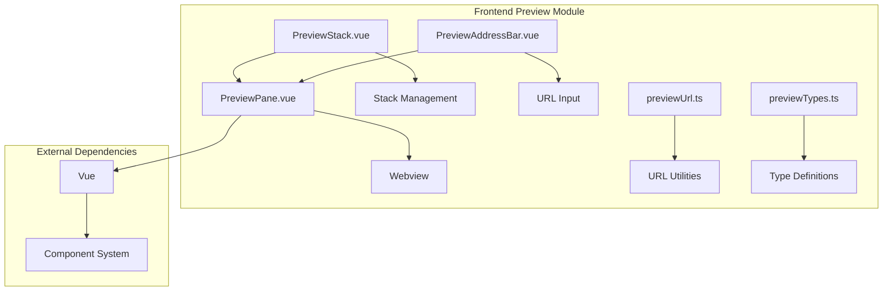

# 预览模块详细设计

## 架构设计

### 整体架构



### 数据流

1. **URL 输入**: 用户输入 → URL 验证 → 加载网页
2. **导航**: 链接点击 → URL 更新 → 加载新页面
3. **刷新**: 用户刷新 → 重新加载 → 更新显示

## 数据结构

### 预览句柄

```typescript
interface PreviewPaneHandle {
  reload: () => void
  focusAddressBar: () => void
  getUrl: () => string
}
```

### URL 配置

```typescript
interface UrlConfig {
  allowedProtocols: string[]
  blockedProtocols: string[]
  defaultProtocol: string
}
```

### 预览状态

```typescript
interface PreviewState {
  url: string
  loading: boolean
  error: string | null
  title: string
}
```

## 算法逻辑

### URL 处理

1. **协议验证**: 验证 URL 协议
2. **URL 规范化**: 规范化 URL 格式
3. **安全检查**: 检查 URL 安全性
4. **错误处理**: 处理无效 URL

### 网页加载

1. **URL 解析**: 解析 URL 组件
2. **请求发送**: 发送 HTTP 请求
3. **内容加载**: 加载网页内容
4. **渲染显示**: 渲染网页显示

### 导航管理

1. **历史记录**: 维护导航历史
2. **前进后退**: 支持前进后退
3. **书签管理**: 管理书签
4. **标签管理**: 管理多个标签

## 错误处理

### URL 错误

1. **格式错误**: 处理 URL 格式错误
2. **协议不支持**: 处理不支持的协议
3. **安全限制**: 处理安全限制
4. **编码错误**: 处理编码错误

### 加载错误

1. **网络错误**: 处理网络错误
2. **服务器错误**: 处理服务器错误
3. **超时**: 处理加载超时
4. **内容错误**: 处理内容错误

## 性能考虑

### 加载优化

1. **预加载**: 预加载常用页面
2. **缓存**: 缓存网页内容
3. **压缩**: 压缩传输内容
4. **并行加载**: 并行加载资源

### 渲染优化

1. **懒渲染**: 按需渲染内容
2. **虚拟滚动**: 大量内容使用虚拟滚动
3. **内存管理**: 管理渲染内存
4. **垃圾回收**: 及时释放资源

## 测试策略

### 单元测试

1. **URL 处理测试**: URL 解析
2. **安全检查测试**: 安全验证
3. **状态管理测试**: 状态更新

### 集成测试

1. **网页加载测试**: 真实网页
2. **导航测试**: 前进后退
3. **错误处理测试**: 错误场景

### 组件测试

1. **面板渲染测试**: UI 组件
2. **地址栏测试**: URL 输入
3. **交互测试**: 刷新、导航

## 相关文件

- 前端: `src/modules/preview/`
- 框架: Vue