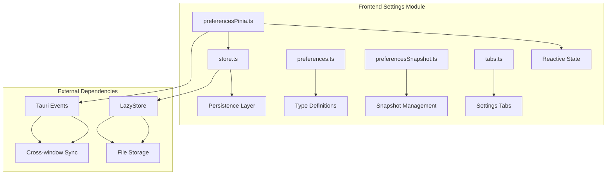

# 设置模块详细设计

## 架构设计

### 整体架构



### 数据流

1. **初始化**: LazyStore → 加载偏好 → Pinia 状态
2. **更新**: 用户修改 → Pinia 更新 → LazyStore 持久化
3. **同步**: 窗口事件 → 状态同步 → UI 更新
4. **快照**: 创建快照 → 恢复快照

## 数据结构

### 偏好设置

```typescript
interface Preferences {
  theme: ThemePref
  language: LanguagePref
  editorTheme: EditorThemeId
  autostart: boolean
  restoreWindowState: boolean
  vimMode: boolean
  fileOpenMode: FileOpenMode
  showHidden: boolean
  terminalWebglEnabled: boolean
  terminalContextMenuEnabled: boolean
  terminalFontFamily: string
  terminalLetterSpacing: number
  terminalFontSize: number
  terminalScrollback: number
  keybindings: KeybindingOverrides
  lastWslDistro: string | null
  lastWorkspace: StoredWorkspace | null
  recentWorkspaces: StoredWorkspace[]
  zoomLevel: number
  sourceControlPanelWidth: number
  explorerPanelWidth: number
  touchOptimizations: TouchMode
  editorFontSize: number
  editorTabSize: number
  editorWordWrap: boolean
}
```

### 偏好快照

```typescript
interface PreferencesSnapshot {
  timestamp: number
  preferences: Preferences
  version: number
}
```

## 算法逻辑

### 持久化策略

1. **延迟保存**: 用户修改后延迟保存
2. **批量保存**: 合并多个修改保存
3. **原子保存**: 保证保存的原子性
4. **版本迁移**: 处理版本兼容性

### 状态同步

1. **事件监听**: 监听 Tauri 事件
2. **状态合并**: 合并不同窗口的状态
3. **冲突解决**: 解决状态冲突
4. **UI 更新**: 更新 UI 反映状态变化

### 快照管理

1. **创建快照**: 保存当前状态
2. **恢复快照**: 恢复到快照状态
3. **快照清理**: 清理旧快照
4. **版本管理**: 管理快照版本

## 错误处理

### 持久化错误

1. **文件锁定**: 处理文件锁定
2. **磁盘空间**: 处理空间不足
3. **权限错误**: 处理权限问题
4. **损坏恢复**: 恢复损坏的配置

### 同步错误

1. **事件丢失**: 处理事件丢失
2. **状态不一致**: 处理状态不一致
3. **网络错误**: 处理网络问题

## 性能考虑

### 持久化优化

1. **延迟写入**: 避免频繁写入
2. **压缩存储**: 压缩配置数据
3. **索引优化**: 优化存储索引
4. **缓存**: 缓存常用配置

### 状态管理优化

1. **响应式**: 使用 Pinia 响应式
2. **计算属性**: 使用计算属性
3. **选择性更新**: 只更新变化的部分
4. **批量更新**: 合并多个更新

## 测试策略

### 单元测试

1. **持久化测试**: 读写操作
2. **状态管理测试**: Pinia store
3. **快照测试**: 创建、恢复

### 集成测试

1. **跨窗口同步测试**: 多窗口
2. **版本迁移测试**: 兼容性
3. **错误恢复测试**: 损坏恢复

### 组件测试

1. **设置面板渲染测试**: UI 组件
2. **交互测试**: 修改、保存
3. **主题切换测试**: 主题应用

## 相关文件

- 前端: `src/modules/settings/`
- 存储: `@tauri-apps/plugin-store`
- 事件: `@tauri-apps/api/event`