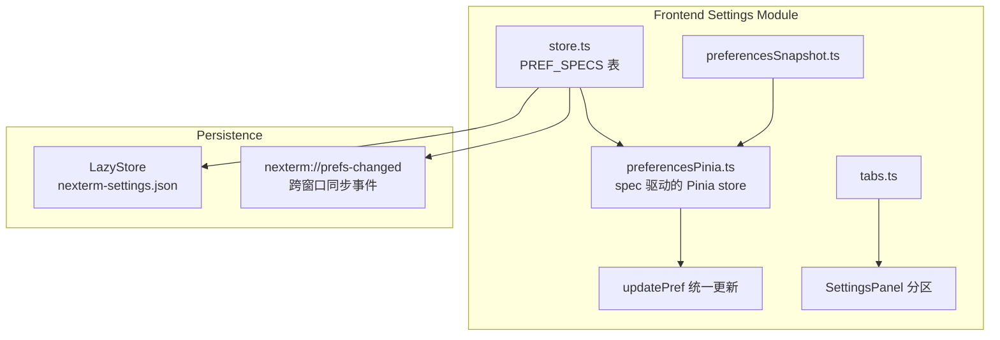

# 设置模块详细设计

> 本文档只描述**已实现**的设计。字段清单以 `src/modules/settings/store.ts` 为唯一事实来源，此处不重复枚举（重复清单会腐烂）。

## 整体架构

## 核心抽象：PREF_SPECS 表

每个偏好一条 spec，包含三个职责：

| 字段 | 职责 | 时机 |
|------|------|------|
| `storageKey` | 存储键映射（默认与字段同名；`layout.leftSidebar` 等例外） | 读/写 |
| `read(raw)` | 磁盘任意 JSON → 合法偏好值（含默认回落、枚举校验、clamp） | `loadPreferences` |
| `sanitize(value)` | 写盘/乐观更新前的同步钳制（幂等） | `updatePref` / `setPreference` |

新增偏好 = `Preferences` 类型加字段 + `DEFAULT_PREFERENCES` 加默认值 + 表加一行；
`store.test.ts` 的"spec 覆盖 DEFAULT_PREFERENCES 每一个键"不变量保证不漏。

## 数据流

1. **启动**：`hydrate()` → `loadPreferences()`（逐键 `spec.read`）→ 替换快照 → 写 ref →
   订阅 `onPreferencesChange`。
2. **更新**：`updatePref(key, value)` → `sanitize` → 乐观写 ref → 快照 patch →
   `setPreference`（`spec.sanitize` 幂等复用）→ `writePref`（store.set + save +
   emit `nexterm://prefs-changed`）。
3. **回灌**：`onPreferencesChange` 同时监听 `store.onChange`（本窗口）与
   `nexterm://prefs-changed`（其它窗口），值视作已 sanitize 直接写 ref 与快照。
4. **Legacy 键**：spec 可声明 `legacyKey`（如 `showHidden` → `showHiddenDirectories`），
   主键缺失时回落读取。

## 持久化策略

- 底层 `LazyStore`（`autoSave: 200`）：写后由插件节流落盘。
- `writePref` 每次显式 `store.save()` 并 emit 事件，保证跨窗口及时性。
- 值损坏不致污染：`spec.read` 对非预期类型回落默认（如 scrollback 收到字符串回落 2000）。

## 跨窗口同步

无冲突解决逻辑：最后写入者胜。回灌路径直接采用事件值（已 sanitize），
以 `preferencesSnapshot` 模块级单例为对照，多窗口间短暂不一致可接受
（与 `LazyStore.onChange` 并存，谁后到谁生效）。

## 错误处理

- `loadPreferences` 整体失败由调用方兜底（`workspacesPinia` 以
  `DEFAULT_PREFERENCES` 回落，`preferencesPinia.hydrate` 保持未水合态）。
- 单键损坏只影响该键（`spec.read` 逐键隔离）。
- `restoreWindowState`（Rust 侧启动路径）读取失败一律按默认 `true` 处理。

## 测试

- `store.test.ts`：spec 覆盖不变量、缺省回落、sanitize 幂等、clamp 边界
- `preferencesSnapshot.test.ts`：快照与 reset
- `src/settings/sections/*.test.ts`：分区渲染 + 交互 + 持久化路径
  （断言 `setPreference` 以正确 key/value 被调用）

## 相关文件

- 前端：`src/modules/settings/`（store / pinia / snapshot / tabs）
- 面板：`src/settings/`（SettingsPanel + 9 个分区组件）
- 存储：`@tauri-apps/plugin-store`
- Rust 启动关联：`src-tauri/src/lib.rs` 的 `should_restore_window_state`
