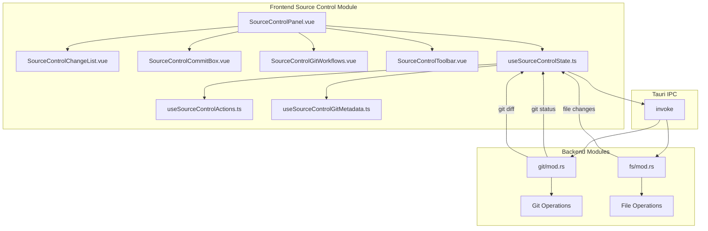

# 源代码控制模块详细设计

## 架构设计

### 整体架构



### 数据流

1. **状态刷新**: 文件变化 → Git 状态查询 → UI 更新
2. **暂存操作**: 用户选择 → Git 暂存 → 状态刷新
3. **提交操作**: 输入消息 → Git 提交 → 通知
4. **分支操作**: 用户操作 → Git 命令 → 状态刷新

## 数据结构

### 文件条目

```typescript
interface SourceControlFileEntry {
  key: string
  group: SourceControlGroupId
  path: string
  originalPath: string | null
  statusCode: string
  statusLabel: string
  statusKind: SourceControlStatusKind
  diffMode: DiffMode
  checkState: CheckState
  staged: boolean
  unstaged: boolean
  untracked: boolean
}
```

### Git 装饰

```typescript
interface GitPathDecoration {
  color: string
  letter: string
  tooltip: string
}

type GitDecorationMap = Map<string, GitPathDecoration>
```

### 状态分组

```typescript
type SourceControlGroupId = "merge" | "index" | "working" | "untracked"

interface SourceControlGroup {
  id: SourceControlGroupId
  label: string
  entries: SourceControlFileEntry[]
}
```

## 算法逻辑

### 状态解析

1. **Git 状态解析**: 解析 `git status --porcelain` 输出
2. **状态码映射**: 将状态码映射为用户友好的标签
3. **分组逻辑**: 根据状态类型分组
4. **装饰生成**: 为文件树生成 Git 装饰

### 暂存管理

1. **批量暂存**: 选择多个文件暂存
2. **部分暂存**: 支持 hunks 暂存
3. **取消暂存**: 从暂存区移除
4. **状态同步**: 暂存后自动刷新状态

### 提交流程

1. **消息验证**: 检查提交消息
2. **暂存检查**: 确认有暂存内容
3. **执行提交**: 调用 Git 提交
4. **后处理**: 刷新状态、通知、清理

## 错误处理

### Git 错误

1. **合并冲突**: 检测冲突状态、提供解决选项
2. **权限错误**: 检查仓库权限
3. **网络错误**: 远程操作失败处理
4. **仓库损坏**: 检测和报告

### 操作错误

1. **暂存失败**: 文件锁定、权限问题
2. **提交失败**: 钩子拒绝、网络问题
3. **分支操作失败**: 冲突、权限

## 性能考虑

### 状态刷新优化

1. **增量更新**: 只更新变化的部分
2. **防抖刷新**: 避免频繁刷新
3. **后台刷新**: 非阻塞刷新
4. **缓存**: 缓存 Git 状态

### UI 优化

1. **虚拟滚动**: 大量文件时使用虚拟滚动
2. **懒加载**: 按需加载文件详情
3. **批量更新**: 合并多个更新操作

## 测试策略

### 单元测试

1. **状态解析测试**: Git 状态输出解析
2. **分组逻辑测试**: 文件分组
3. **装饰生成测试**: Git 装饰

### 集成测试

1. **Git 操作测试**: 暂存、提交、分支
2. **状态同步测试**: 操作后状态更新
3. **错误处理测试**: 各种错误场景

### 组件测试

1. **面板渲染测试**: UI 组件渲染
2. **交互测试**: 用户操作响应
3. **状态管理测试**: 状态更新

## 相关文件

- 前端: `src/modules/source-control/`
- 后端: `src-tauri/src/modules/git/`
- 通知: `src/modules/notifications/`
- 命令: `src/modules/commands/`