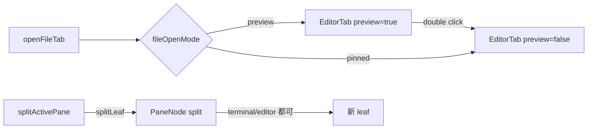

# 标签页 tabs

## 1. 概述

标签页模块统一管理 tab 数组、activeId、pane 拆分、关闭守卫、拖拽重排。终端 tab 内部还可继续 split pane（pane 树由 `terminal/lib/panes.ts` 维护）。

## 2. 目录与文件

```
src/modules/tabs/
  tabsPinia.ts        # 核心 store（setup-function）
  tabsTypes.ts        # Tab / TerminalTab / EditorTab / ...
  tabsReorder.ts      # 拖拽重排
  closeGuards.ts      # 关闭前的脏检查 / 确认
  tabLabel.ts         # tab 标题格式化
  terminalDisposal.ts # 关闭终端 tab 的清理
  index.ts
```

## 3. 依赖

### 3.1 内部

- `@/modules/terminal/lib/panes` -- `PaneNode` / `splitLeaf` / `leafIds`
- `@/modules/settings/preferencesPinia` -- `fileOpenMode`（preview/pinned）
- `@/modules/workspace/workspaceRootPinia` -- 默认 cwd
- `@/modules/notifications/notificationCenter` -- 关闭失败提示

### 3.2 外部

无新增外部依赖。

## 4. 数据契约

### 4.1 公共类型

```ts
// tabsTypes.ts
export type Tab =
  | TerminalTab
  | EditorTab
  | PreviewTab
  | MarkdownTab
  | GitDiffTab
  | GitHistoryTab
  | GitCommitFileDiffTab;

export const MAX_PANES_PER_TAB = 4;
```

### 4.2 Tauri 命令

不直接 invoke；通过其他模块的 composable 间接调用。

### 4.3 事件

无独立事件。

## 5. Pinia 状态

`useTabsPiniaStore` 是核心 store，setup-function 模式：

- state：`tabs`、`activeId`
- getter：`activeTab`
- action：`init` / `resetWorkspace` / `setActiveId` / `newTab` / `newTaskTerminal` / `openFileTab` / `pinTab` / `moveTab` / `newPreviewTab` / `newMarkdownTab` / `openGitDiffTab` / `openCommitHistoryTab` / `openCommitFileDiffTab` / `closeTab` / `focusPane` / `setLeafCwd` / `setLeafTitle` / `updateTab` / `splitActivePane` / `closeActivePane`

## 6. 关键算法



- `MAX_PANES_PER_TAB = 4` 防止无限制拆分。
- `closeTab` 调 `closeGuards` 检查 dirty，再调 `terminalDisposal.disposeTerminalSession` 释放 PTY。

## 7. 配置项

- `preferencesPinia.fileOpenMode` -- "preview" / "pinned"
- `MAX_PANES_PER_TAB = 4`（内部常量）

## 8. 测试

- `tabsPinia.test.ts` -- 大量用例
- `closeGuards.test.ts` / `tabLabel.test.ts` -- 关闭守卫 / 标题
- `terminalDisposal.ts` -- 由 `terminal` 模块覆盖

## 9. 相关文档

- [详细设计](./detailed-design.md)
- [02-module-contracts.md](./../02-module-contracts.md) -- Pinia 写法约束
