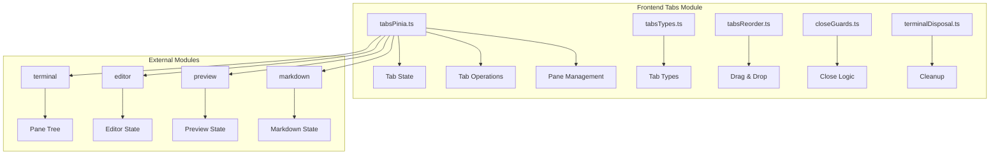

# 标签页管理模块详细设计

## 架构设计

### 整体架构



### 数据流

1. **标签创建**: 用户操作 → 创建标签 → 激活标签
2. **标签切换**: 用户选择 → 切换激活 → 更新 UI
3. **标签关闭**: 用户关闭 → 守卫检查 → 清理资源
4. **标签重排**: 拖拽操作 → 更新顺序 → 保存状态

## 数据结构

### 标签类型

```typescript
type Tab = TerminalTab | EditorTab | PreviewTab | MarkdownTab | GitDiffTab | GitHistoryTab | GitCommitFileDiffTab

interface BaseTab {
  id: number
  kind: string
  title: string
}

interface TerminalTab extends BaseTab {
  kind: "terminal"
  terminalTitle?: string
  cwd?: string
  paneTree: PaneNode
  activeLeafId: number
}

interface EditorTab extends BaseTab {
  kind: "editor"
  path: string
  dirty: boolean
  preview: boolean
}
```

### 面板树

```typescript
interface PaneNode {
  id: number
  type: "leaf" | "split"
  direction?: "horizontal" | "vertical"
  children?: PaneNode[]
  size?: number
  terminalId?: number
  cwd?: string
  title?: string
}
```

### 标签补丁

```typescript
type TabPatch = Partial<{
  title: string
  cwd: string
  path: string
  dirty: boolean
  url: string
}>
```

## 算法逻辑

### 标签管理

1. **ID 分配**: 自增 ID 分配
2. **激活管理**: 单一激活标签
3. **顺序维护**: 标签顺序
4. **状态持久化**: 保存标签状态

### 面板树操作

1. **分割**: 水平/垂直分割
2. **关闭**: 关闭面板
3. **调整大小**: 调整面板大小
4. **焦点管理**: 面板焦点切换

### 关闭守卫

1. **脏检查**: 检查未保存更改
2. **确认对话框**: 显示确认对话框
3. **批量关闭**: 支持批量关闭
4. **强制关闭**: 跳过守卫关闭

## 错误处理

### 标签错误

1. **ID 冲突**: 唯一 ID 保证
2. **状态损坏**: 状态恢复
3. **内存泄漏**: 资源清理

### 面板错误

1. **树损坏**: 树结构恢复
2. **终端清理**: 终端会话清理
3. **编辑器清理**: 编辑器状态清理

## 性能考虑

### 状态管理优化

1. **响应式**: 使用 Pinia 响应式
2. **批量更新**: 合并多个更新
3. **延迟渲染**: 非激活标签延迟渲染
4. **内存监控**: 监控标签内存使用

### UI 优化

1. **虚拟标签**: 大量标签时使用虚拟滚动
2. **懒加载**: 按需加载标签内容
3. **缓存**: 缓存标签状态

## 测试策略

### 单元测试

1. **ID 分配测试**: 唯一 ID
2. **状态管理测试**: Pinia store
3. **面板树测试**: 树操作

### 集成测试

1. **标签生命周期测试**: 创建、切换、关闭
2. **面板操作测试**: 分割、调整、关闭
3. **关闭守卫测试**: 脏检查、确认

### 组件测试

1. **标签栏渲染测试**: UI 组件
2. **拖拽重排测试**: 交互
3. **面板渲染测试**: 内容渲染

## 相关文件

- 前端: `src/modules/tabs/`
- 终端: `src/modules/terminal/`
- 编辑器: `src/modules/editor/`
- 预览: `src/modules/preview/`