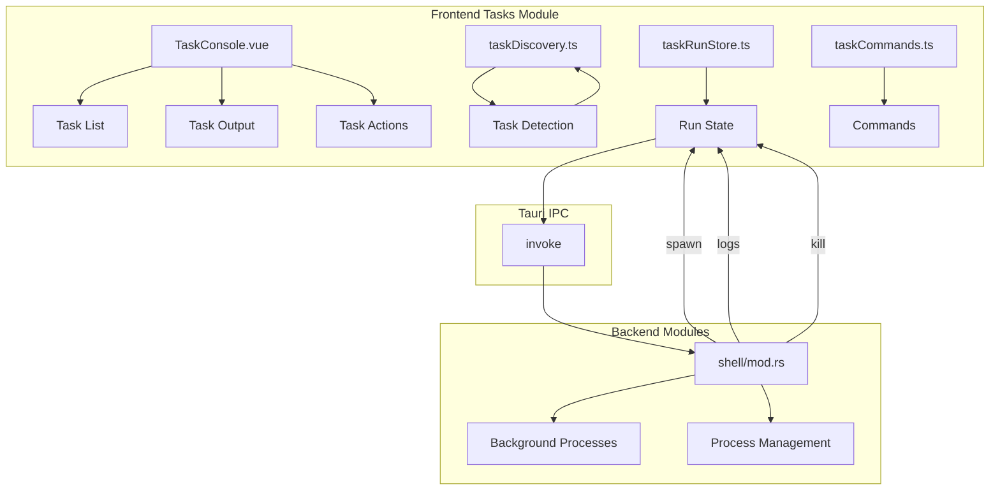

# 任务管理模块详细设计

## 架构设计

### 整体架构



### 数据流

1. **任务发现**: 项目文件 → 解析配置 → 任务列表
2. **任务执行**: 用户选择 → 启动进程 → 监控输出
3. **任务管理**: 运行状态 → 用户操作 → 进程控制

## 数据结构

### 任务定义

```typescript
interface WorkspaceTask {
  id: string
  title: string
  command: string
  source: "package" | "cargo" | "make"
  detail: string
}
```

### 任务运行

```typescript
interface TaskRun {
  id: number
  handle: number | null
  groupId: number | null
  task: WorkspaceTask | null
  title: string
  command: string
  cwd: string
  status: TaskRunStatus
  exitCode: number | null
  startedAtMs: number
  log: string
  logOffset: number
  droppedBytes: number
  error: string | null
}

type TaskRunStatus = "pending" | "running" | "exited" | "error"
```

### 任务发现配置

```typescript
interface TaskDiscoveryConfig {
  packageManager: "pnpm" | "yarn" | "bun" | "npm"
  cargoEnabled: boolean
  makeEnabled: boolean
}
```

## 算法逻辑

### 任务发现

1. **package.json 解析**: 提取 scripts
2. **Cargo.toml 解析**: 提取 cargo 命令
3. **Makefile 解析**: 提取 make targets
4. **优先级排序**: 按优先级排序任务

### 任务执行

1. **进程启动**: 后台启动进程
2. **输出轮询**: 定期轮询输出
3. **状态监控**: 监控进程状态
4. **资源清理**: 进程结束后清理

### 输出管理

1. **增量读取**: 只读取新输出
2. **缓冲管理**: 管理输出缓冲
3. **丢弃处理**: 处理丢弃的字节
4. **滚动控制**: 自动滚动到底部

## 错误处理

### 任务错误

1. **启动失败**: 命令不存在、权限问题
2. **执行错误**: 进程崩溃、超时
3. **输出错误**: 读取失败、编码问题

### 发现错误

1. **文件不存在**: 项目文件缺失
2. **解析错误**: 配置文件格式错误
3. **权限错误**: 文件读取权限

## 性能考虑

### 轮询优化

1. **自适应轮询**: 根据输出频率调整
2. **批量读取**: 合并多个读取操作
3. **后台轮询**: 非阻塞轮询
4. **停止轮询**: 无输出时停止

### 内存优化

1. **输出限制**: 限制输出大小
2. **垃圾回收**: 及时释放不用的输出
3. **对象池**: 复用任务对象

## 测试策略

### 单元测试

1. **任务发现测试**: 配置解析
2. **状态管理测试**: Pinia store
3. **输出处理测试**: 增量读取

### 集成测试

1. **任务执行测试**: 真实进程
2. **输出轮询测试**: 定时轮询
3. **进程管理测试**: 启动、监控、清理

### 组件测试

1. **控制台渲染测试**: UI 组件
2. **交互测试**: 启动、停止、重启
3. **输出显示测试**: 日志显示

## 相关文件

- 前端: `src/modules/tasks/`
- 后端: `src-tauri/src/modules/shell/`
- 命令: `src/modules/commands/`