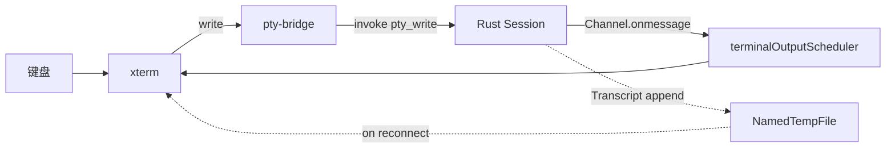

# 终端 terminal

> 详细算法看 [./detailed-design.md](./detailed-design.md)；后端 PTY 模块看 [04-security-model](./../04-security-model.md)。

## 1. 概述

终端模块承载标签页内的所有终端渲染与 PTY 桥接。xterm.js 负责显示，Rust `pty::*` 负责实际进程，通信走 Tauri `Channel` 与 `Transcript` 临时文件双轨制。

## 2. 目录与文件

```
src/modules/terminal/
  TerminalPane.vue            # 终端面板
  TerminalStack.vue           # 多终端栈容器
  PaneTreeV2.vue              # pane 拆分树渲染
  TerminalToolbar.vue         # 终端工具条
  terminalCommands.ts         # 注册到 commands 的终端命令
  index.ts
  lib/
    panes.ts                  # PaneNode / splitLeaf / leafIds 等
    pty-bridge.ts             # 对 native.ptyOpen 的薄封装
    rendererPool.ts           # xterm 实例池
    terminalSessionCore.ts    # 终端会话核心（写入、resize、关闭）
    terminalOutputScheduler.ts# rAF / setTimeout 合并
    osc-handlers.ts           # OSC 7（cwd）等序列
    useTerminalNotification.ts# 终端相关通知
    keymap.ts                 # 键位映射
```

## 3. 依赖

### 3.1 内部

- `@/lib/native` -- 所有 PTY 调用
- `@/lib/path` -- 路径归一化
- `@/lib/useEventListener` -- window resize 订阅
- `@/modules/settings/preferencesPinia` -- 终端字体 / 字号 / 主题
- `@/modules/workspace/workspaceEnvPinia` -- 终端启动 cwd
- `@/modules/notifications/notificationCenter` -- 终端错误提示
- `@/modules/tabs` -- TerminalTab 形态

### 3.2 外部

- `@xterm/xterm` + `@xterm/addon-{fit,search,serialize,web-links,webgl}`
- `xterm-addon-*` （项目内联别名）

## 4. 数据契约

### 4.1 公共类型

```ts
// panes.ts
type PaneNode =
  | { kind: "leaf"; id: number; cwd?: string; title?: string }
  | { kind: "split"; dir: "h" | "v"; children: [PaneNode, PaneNode]; sizes: [number, number] };
```

### 4.2 Tauri 命令

| 命令 | 参数 | 返回 | 说明 |
|------|------|------|------|
| `pty_open` | `{cols, rows, cwd?, workspace?}` + `onData` / `onExit` Channel | `id: u32` | 打开会话，Channel 流式输出 |
| `pty_write` | `{id, data}` | `void` | 写入 |
| `pty_resize` | `{id, cols, rows}` | `void` | 调整 |
| `pty_read_transcript` | `{id, sinceOffset, maxBytes}` | `PtyTranscriptRead` | 拉取 transcript 片段 |
| `pty_close` | `{id}` | `void` | 关闭，drop 在独立线程 |

### 4.3 事件

无独立事件。PTY 输出走 `Channel`；关闭通知走 `onExit` Channel。

## 5. Pinia 状态

无独立 store。Pane tree / activeLeafId 由 `tabsPinia` 管理；终端实例本身在 `terminalSessionCore` 内部 ref。

## 6. 关键算法



- `rendererPool` 跨 pane 共享 xterm 实例，避免重复创建字体加载 / webgl 上下文。
- `terminalOutputScheduler` 用 rAF + microtask 合并多帧写入。
- 关 pane 时调 `pty_close`；Rust drop `Arc<Session>` 在独立线程（`nexterm-pty-drop-{id}`）。

## 7. 配置项

从 `preferencesPinia` 读：

- `terminalFontFamily` / `terminalFontSize` / `terminalLetterSpacing`
- `terminalScrollback`
- `terminalWebglEnabled`
- `terminalContextMenuEnabled`
- 主题由 `src/styles/terminalTheme.ts` 从 `AppTokens` 派生

内部常量（`panes.ts`）：`MAX_PANES_PER_TAB = 4`。

## 8. 测试

- `lib/panes.test.ts` -- pane 拆分
- `lib/osc-handlers.test.ts` -- OSC 7 解析
- `lib/keymap.test.ts` -- 键位
- `lib/rendererPool.test.ts` -- 池化
- `lib/terminalSessionCore.test.ts` -- 会话核心
- `TerminalPane.vue.test.ts` / `TerminalStack.vue.test.ts` -- 组件
- `terminalVueBoundary.test.ts` -- 模块边界

## 9. 相关文档

- [详细设计](./detailed-design.md)
- [04-security-model.md](./../04-security-model.md) -- Job Object / ConPTY 序列化 / Transcript
