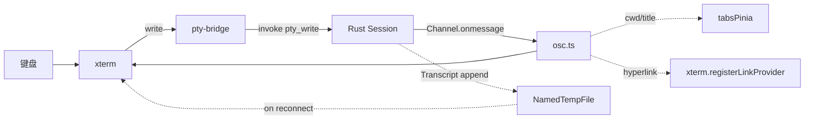

# 终端 terminal

> 详细算法看 [./detailed-design.md](./detailed-design.md);后端 PTY 模块看 [../04-security-model](../04-security-model.md)。

## 1. 概述

终端模块承载标签页内的所有终端渲染与 PTY 桥接。xterm.js 负责显示,Rust `pty::*` 负责实际进程,通信走 Tauri `Channel` 与 `Transcript` 临时文件双轨制。

本次重构对齐 VSCode / Tabby / Ghostty / Rio 等成熟终端的设计,核心改动:

- **分层字体回退栈**:`primary → symbol → cjk → emoji → fallback`,避免主字体缺符号时整个 tofu
- **渲染管线三级(降为二级)回退**:WebGL → DOM,xterm v6 canvas addon 仍在 beta,本期不接
- **选项聚合器** `terminalOptions.ts`:所有 xterm 选项集中,主题/设置变更后单点重算
- **HiDPI / DPI 监听**:Windows 125%~200% 缩放下字符不再发虚
- **OSC 升级**:增加 OSC 8 超链接;OSC 52 clipboard 由 addon-clipboard 处理
- **偏好 + 设置面板拆分**:字体 / 行为 / 渲染器三块独立子组件,字段从 21 增至 ~50

## 2. 目录与文件

```
src/modules/terminal/
  TerminalPane.vue              # 终端面板(单 pane 内单 xterm)
  TerminalWorkspace.vue         # 多 pane 树容器
  TerminalResizer.vue           # pane 之间的拖拽条
  TerminalSearch.vue            # 终端内搜索 UI
  TerminalContextMenu.vue       # 右键菜单
  index.ts                      # 公共导出
  lib/
    fontStack.ts                # 分层字体栈(primary/symbol/cjk/emoji)
    renderer.ts                 # Terminal 工厂与生命周期(整合)
    rendererPipeline.ts         # WebGL→DOM 渲染管线
    terminalOptions.ts          # xterm ITerminalOptions 聚合器
    addons.ts                   # fit/search/unicode/web-links/serialize/clipboard
    dpiWatcher.ts               # devicePixelRatio 监听
    theme.ts                    # CSS 变量 → xterm ITheme
    osc.ts                      # OSC 7/0/2/8 解析
    sessions.ts                 # PtySessionHandle 单会话模型
    shortcuts.ts                # 自定义键位(剪贴板 copy/paste)
    layout.ts                   # PaneNode / splitLeaf / leafIds 等
    bell.ts                     # BEL 响铃：toast/系统通知 + 可选蜂鸣（冷却限流）
    commands.ts                 # 注册到 commands 的终端命令
```

## 3. 依赖

### 3.1 内部

- `@/lib/native` -- 所有 PTY 调用
- `@/lib/path` -- 路径归一化
- `@/lib/clipboard` -- 剪贴板读写(传给 addon-clipboard)
- `@/lib/useEventListener` -- window resize 订阅
- `@/modules/settings/preferencesPinia` -- 终端字体 / 字号 / 主题
- `@/modules/workspace/workspaceEnvPinia` -- 终端启动 cwd
- `@/modules/notifications/notificationCenter` -- 终端错误提示 / 响铃 toast
- `@/lib/osNotifications` -- 窗口失焦时的系统级响铃通知
- `@/modules/tabs` -- TerminalTab 形态

### 3.2 外部

- `@xterm/xterm` + `@xterm/addon-{fit,search,serialize,unicode11,web-links,webgl,clipboard}`
- `@fontsource/jetbrains-mono` -- 拉丁 + 西里尔 + 斜体(主等宽兜底)
- `@fontsource-variable/noto-sans-mono` -- variable 字体回退
- `@fontsource/noto-sans-mono` -- 备用打包
- `@azurity/pure-nerd-font` -- 符号字体兜底(Nerd Font 子集)

> ⚠️ `@xterm/addon-canvas` 未引入:xtermjs/xterm.js#4914 canvas addon 仍在 beta(0.8.x),
>   依赖 v5 内部 API,在 v6 上跑不起来。WebGL 失败时回退 xterm 内置 DOM 渲染器。

## 4. 数据契约

### 4.1 公共类型

```ts
// fontStack.ts
interface FontStack {
  primary: string;   // 主等宽字体
  symbol: string;    // Nerd Font 符号字体(primary 已是 Nerd variant 时为空)
  cjk: string;       // CJK 字体
  emoji: string;     // Emoji 字体
  fallback: string;  // 平台原生兜底
}

// rendererPipeline.ts
type RendererKind = "webgl" | "dom";
interface RendererPipeline {
  active: () => RendererKind;
  setPreferred: (k: RendererKind) => void;
  dispose: () => void;
}

// layout.ts
type PaneNode =
  | { kind: "leaf"; id: number; cwd?: string; title?: string }
  | { kind: "split"; dir: "h" | "v"; children: [PaneNode, PaneNode]; sizes: [number, number] };
```

### 4.2 Tauri 命令

| 命令 | 参数 | 返回 | 说明 |
|------|------|------|------|
| `pty_open` | `{cols, rows, cwd?, shellId?, workspace?}` + `onData` / `onExit` Channel | `id: u32` | 打开会话,Channel 流式输出 |
| `pty_write` | `{id, data}` | `void` | 写入 |
| `pty_resize` | `{id, cols, rows}` | `void` | 调整 |
| `pty_read_transcript` | `{id, sinceOffset, maxBytes}` | `PtyTranscriptRead` | 拉取 transcript 片段 |
| `pty_close` | `{id}` | `void` | 关闭,drop 在独立线程 |
| `shell_list_profiles` | `{}` | `ShellProfile[]` | 探测本机可用 shell profile(id/name/program/args/kind) |

### 4.3 本地 Shell Profile(Windows)

`pty_open` 的 `shellId` 只接收 `shell_list_profiles` 返回的 profile id,
真实路径解析收敛在 Rust 白名单里(`src-tauri/src/modules/shell/profiles.rs`),
webview 无法借此拉起白名单之外的程序。id 缺失 / `"auto"` / 未命中时
回退历史默认顺序(pwsh → Windows PowerShell → CMD)。按 `kind` 注入
shell 集成:`powershell` 走 profile.ps1,`bash`(Git Bash)走
`--rcfile`(复用 WSL bash 脚本,链回用户 rc 模拟登录初始化),其余裸启动。
偏好项 `terminalShellId` 仅影响新开的终端;WSL / SSH 环境有各自的登录
shell 逻辑,忽略此参数。一次性命令(`shell_run_command`)不受该偏好影响,
始终用 auto 选择。

> Unix 本地终端同样接收 `shellId`:非 `"auto"` 时按 `profiles::resolve_unix_shell_program`
> 在 `passwd` 登录 shell / `$SHELL` / `/etc/shells` 探测列表内匹配,未命中则
> 回退默认 shell。设置 UI 当前仅在 Windows 暴露该下拉(`v-if="IS_WINDOWS"`),
> macOS / Linux 下偏好始终为 `"auto"`,行为与历史完全一致。

### 4.4 事件

无独立事件。PTY 输出走 `Channel`;关闭通知走 `onExit` Channel。
设置项变更走 `nexterm://prefs-changed` 事件,主题模块(`theme.ts`)订阅后强制 apply。

## 5. Pinia 状态

无独立 store。Pane tree / activeLeafId 由 `tabsPinia` 管理;终端实例本身在 TerminalPane 内部 ref;
偏好由 `preferencesPinia` 管理,通过 ref 同步给 TerminalPane。

新增字段(`preferencesPinia`):

| 字段 | 类型 | 默认 | 说明 |
|------|------|------|------|
| `terminalFontWeight` | 100..900 | 400 | 主字重 |
| `terminalFontWeightBold` | 100..900 | 700 | 粗体字重 |
| `terminalNerdFontEnabled` | boolean | true | Nerd Font 符号层开关 |
| `terminalCjkFontEnabled` | boolean | true | CJK 字体兜底 |
| `terminalEmojiFontEnabled` | boolean | true | Emoji 字体兜底 |
| `terminalCursorStyle` | block/underline/bar | block | 光标样式 |
| `terminalCursorBlink` | boolean | true | 光标闪烁 |
| `terminalCursorInactiveStyle` | outline/block/bar/underline/none | outline | 非激活光标 |
| `terminalRenderer` | webgl/dom | webgl | 渲染器类型 |
| `terminalRendererAutoFallback` | boolean | true | 失败自动降级 |
| `terminalFastScrollSensitivity` | 1..20 | 5 | 快速滚动灵敏度 |
| `terminalFastScrollModifier` | alt/ctrl/shift | alt | 快速滚动修饰键 |
| `terminalMacOptionIsMeta` | boolean | true | Mac Option 作为 Meta |
| `terminalMinimumContrastRatio` | 1..21 | 1 | 最低对比度(亮色主题调到 4.5) |
| `terminalDrawBoldTextInBrightColors` | boolean | true | 亮色加粗 |
| `terminalCustomGlyphs` | boolean | true | 自定义字形 |
| `terminalRescaleOverlappingGlyphs` | boolean | true | 缩放宽字符 |

## 6. 关键算法



- `fontStack.buildFontStack` 自动检测平台(Mac/Windows/Linux)与系统已装 Nerd/CJK/Emoji 字体,
  拼接成 CSS font-family 串
- `rendererPipeline` 在 WebGL 失败时降级 DOM,连续 3 次 context loss 永久降级
- `dpiWatcher` 用 matchMedia 监听 resolution 变化,触发 `setDevicePixelRatio` + 重建字符纹理
- `theme.ts` 监听 document.fonts `loadingdone` 事件,字体异步加载完成后强制重画
- OSC 8 hyperlink 通过 `sanitizeHyperlinkUri` 过滤危险协议(只允许 http(s)/file/ssh/vscode)
- `clipboardAddon` 通过 `IClipboardProvider` 桥接 Tauri `clipboard-manager`

## 7. 配置项

从 `preferencesPinia` 读,详见 [§5](#5-pinia-状态)。设置面板拆分为三个子组件:

- `TerminalAppearanceSection.vue` -- 字体 / 字号 / 字重 / 间距 / 光标 / 对比度 / Nerd/CJK/Emoji 开关
- `TerminalBehaviorSection.vue` -- 滚动回溯 / 快速滚动 / OSC / 加粗 / 右键菜单 / 通知
- `TerminalRendererSection.vue` -- WebGL/DOM 选择 + 自动降级 + 旧版 webgl 开关

主题由 `src/styles/globals.css` 派生,所有色值通过 `getComputedStyle` 读 `--term-*` 变量,
新版本增 `--term-link` 和 `--term-padding-{x,y}`。

## 8. 验证

- `pnpm test` 全绿(包含新测试,且不引入新的失败用例)
- `pnpm build` 通过
- WebGL 主动 disable(canvas 模式)时仍能跑 tmux/htop 等 TUI
- 启动后切到一个非 Nerd Font(例如 `Cascadia Mono`),lualine/powerline 仍显示箭头图标
- Mac 上 Option+Click 不再误触发 Meta
- 150% Windows DPI 下字符不发虚
- 设置面板分组清晰,新字段 UI 与 i18n 同步

## 9. 不在本期范围

- 终端 AI 集成(command palette AI 命令)
- 终端录制/回放(`.cast` 文件)
- 终端标签页拖拽排序(Tabby 风格)
- 命令面板模糊搜索 xterm addons
- 主题市场(Tabby 的主题商店)
- `@xterm/addon-canvas` 接入(等 xtermjs/xterm.js#4914 合并)
- `@xterm/addon-ligatures` 接入(同上)

以上放在后续独立 plan。