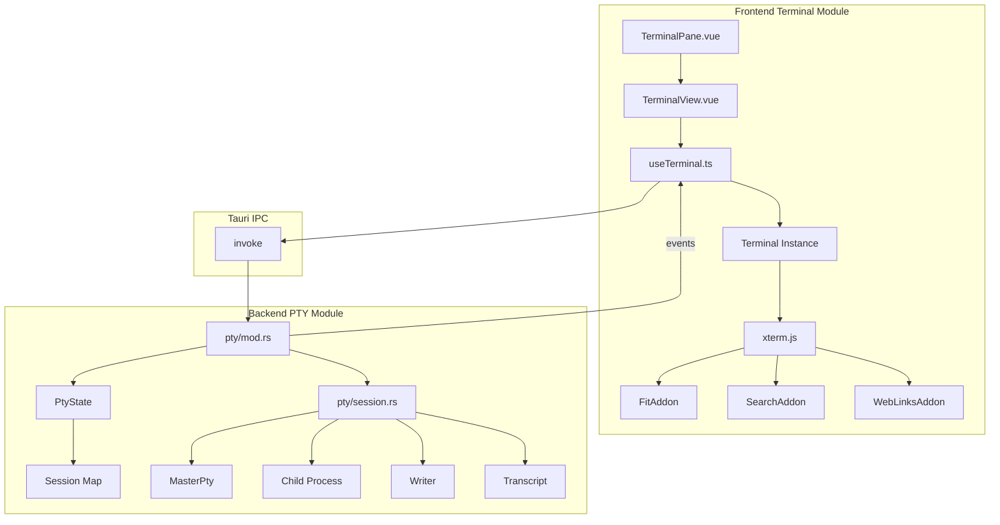

# 终端模块详细设计

## 架构设计

### 整体架构



### 数据流

1. **用户输入**: 键盘事件 → xterm.js → PTY 写入
2. **PTY 输出**: PTY 输出 → Transcript → Tauri 事件 → xterm.js 渲染
3. **终端调整**: 窗口大小变化 → fitAddon → PTY resize

## 数据结构

### PTY 会话状态

```rust
pub struct PtyState {
    sessions: RwLock<HashMap<u32, Arc<Session>>>,
    next_id: AtomicU32,
}

pub struct Session {
    #[cfg(windows)] _job: Option<PtyJob>,
    pub killer: Mutex<Box<dyn ChildKiller + Send + Sync>>,
    pub writer: Arc<Mutex<Box<dyn Write + Send>>>,
    pub master: Mutex<Box<dyn MasterPty + Send>>,
    pub(crate) transcript: Arc<Transcript>,
}
```

### Transcript 存储

```rust
pub struct Transcript {
    file: Mutex<NamedTempFile>,
    size: AtomicU64,
}

impl Transcript {
    pub fn append(&self, data: &[u8]) -> io::Result<()> { ... }
    pub fn read(&self) -> io::Result<String> { ... }
    pub fn read_from(&self, offset: u64) -> io::Result<String> { ... }
}
```

### 前端状态

```typescript
interface TerminalState {
  instances: Map<number, TerminalInstance>
  activeId: number | null
  config: TerminalConfig
}

interface TerminalInstance {
  id: number
  xterm: Terminal
  element: HTMLElement
  fitAddon: FitAddon
  searchAddon: SearchAddon
  webLinksAddon: WebLinksAddon
}
```

## 算法逻辑

### PTY 会话管理

1. **创建会话**:
   - 分配唯一 ID
   - 创建 PTY 主从对
   - 启动子进程
   - 创建 Transcript 存储
   - 注册到会话映射

2. **数据写入**:
   - 获取会话写入器
   - 写入数据到 PTY
   - 处理写入错误

3. **数据读取**:
   - 后台线程读取 PTY 输出
   - 追加到 Transcript
   - 通过 Tauri 事件发送到前端
   - 前端更新 xterm.js 显示

4. **会话关闭**:
   - 终止子进程
   - 清理资源
   - 从映射中移除

### 终端渲染优化

1. **批量更新**: 使用 requestAnimationFrame 批量处理输出
2. **虚拟滚动**: xterm.js 内置虚拟滚动
3. **内存管理**: 限制 scrollback 行数
4. **主题同步**: 实时同步应用主题到终端

## 错误处理

### PTY 错误

1. **创建失败**: 检查 shell 路径、权限、系统资源
2. **写入错误**: 检查 PTY 状态、进程存活
3. **读取错误**: 检查文件权限、磁盘空间
4. **调整大小错误**: 检查 PTY 状态、尺寸有效性

### 前端错误

1. **连接失败**: 重试机制、错误提示
2. **渲染错误**: 降级处理、错误边界
3. **内存不足**: 清理旧会话、限制实例数

## 性能考虑

### 后端性能

1. **异步 I/O**: 使用 Tokio 异步运行时
2. **内存池**: 复用缓冲区减少分配
3. **批量写入**: 合并小数据包减少系统调用
4. **Transcript 限制**: 限制文件大小，自动清理

### 前端性能

1. **懒加载**: 按需加载 xterm.js 扩展
2. **虚拟化**: 只渲染可见区域
3. **节流调整**: 窗口调整大小时节流处理
4. **内存监控**: 监控终端实例内存使用

## 测试策略

### 单元测试

1. **PTY 会话测试**: 创建、写入、读取、关闭
2. **Transcript 测试**: 追加、读取、清理
3. **状态管理测试**: 会话映射、ID 分配

### 集成测试

1. **端到端测试**: 前端到后端完整流程
2. **性能测试**: 大量输出处理
3. **压力测试**: 多会话并发

### 组件测试

1. **TerminalView 测试**: 渲染、事件处理
2. **useTerminal 测试**: 状态管理、生命周期
3. **配置测试**: 主题、字体、快捷键

## 相关文件

- 前端: `src/modules/terminal/`
- 后端: `src-tauri/src/modules/pty/`
- 配置: `src/modules/settings/`
- 样式: `src/styles/terminalTheme.ts`