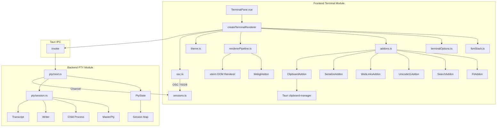

# 终端模块详细设计

## 架构设计

### 整体架构(v3 重构后)



### 数据流

1. **用户输入**: 键盘事件 → xterm.js → PTY 写入
2. **PTY 输出**: PTY 输出 → osc.ts 解析 → 拆分 (cleaned, events) → term.write + tab/title 更新
3. **终端调整**: 窗口大小变化 → dpiWatcher / resizeObserver → fitAddon → PTY resize
4. **WebGL 故障**: WebGL context loss → rendererPipeline 降级 DOM,连续 3 次永久降级

## 数据结构

### 分层字体栈

```ts
interface FontStack {
  primary: string;   // 主等宽字体(用户预设或自动检测)
  symbol: string;    // Nerd Font 符号字体(primary 已是 Nerd variant 时为空)
  cjk: string;       // CJK 字体
  emoji: string;     // Emoji 字体
  fallback: string;  // 平台原生兜底
}

// 例:Cascadia Mono 预设 + Win + Nerd/CJK/Emoji 全部启用
{
  primary: '"Cascadia Mono"',
  symbol: '"Pure Nerd Font"',     // jsdom 没有真实系统字体,运行时由 detectInstalledNerdFont 替换
  cjk: '"Noto Sans Mono CJK SC"',
  emoji: '"Segoe UI Emoji"',
  fallback: '"Cascadia Mono", "Consolas", ui-monospace',
}
```

### 渲染管线状态机

```ts
type RendererKind = "webgl" | "dom";
interface RendererState {
  preferred: RendererKind;       // 用户设置
  active: RendererKind;          // 当前实际生效
  webgl: WebglState | null;      // 当前 WebglAddon + 状态
  retryTimer: Timer | null;      // context loss 后重试
}
```

```
         preferred=webgl
[init] ────────────────► [webgl attached]
   │                       │
   │ WebGL 初始化失败       │ context loss
   ▼                       ▼
[dom fallback] ◄──────── [webgl detached]
   ▲                       │
   │                       │ 连续 3 次
   │ preferred=dom         ▼
   └──────────────  [permanent dom]
```

### Terminal Options 聚合

```ts
interface TerminalOptionsInput {
  typography: { fontFamily, fontSize, fontWeight, fontWeightBold, letterSpacing };
  cursor:     { style, width, blink, inactiveStyle };
  behavior:   { scrollback, fastScrollSensitivity, fastScrollModifier, scrollOnUserInput,
                macOptionIsMeta, macOptionClickForcesSelection, minimumContrastRatio,
                drawBoldTextInBrightColors, customGlyphs, rescaleOverlappingGlyphs };
  render:     { renderer, autoFallback, watchDpi };
  theme:      ITheme;
}

function buildTerminalOptions(input): ITerminalOptions {
  // letterSpacing: 用户输入 -10..10 → deriveLetterSpacingPx(fontSize, strength)
  //   = round(fontSize * 0.04 * (strength / 5))
  // 所有数值做 clamp (fontWeight → 100..900 ladder; minimumContrastRatio → 1..21 等)
}
```

## 算法逻辑

### 字体栈构建

1. **平台探测**:`navigator.userAgent` 区分 Mac/Windows/Linux/Other
2. **主字体解析**:
   - 用户预设名非空 → `quoteFontFamily(presetName)` 包引号
   - 否则 → `detectInstalledMonoFont()` 走 NERD_FONT_CANDIDATES 探测
3. **符号字体判定**:
   - 用户预设已含 "Nerd Font" / "Nerd" / "Symbols Nerd" → 不追加符号层
   - 否则探测系统 Nerd 字体,无则用打包的 `Pure Nerd Font`
4. **CJK / Emoji 探测**:按平台候选列表扫描 `document.fonts.check()`
5. **拼接 CSS**:`primary, symbol, cjk, emoji, fallback` 拼接成 `fontFamily` 串

### WebGL → DOM 降级

```ts
function attachWebgl() {
  if (preferred !== "webgl" || webglBlocked) return;
  try {
    addon = new WebglAddon();
  } catch {
    if (autoFallback) activeKind = "dom";
    return;
  }
  addon.onContextLoss(() => {
    lossCount++;
    detachWebgl();
    if (lossCount >= 3) {
      webglBlocked = true;
      preferred = "dom";
      activeKind = "dom";
      return;
    }
    setTimeout(attachWebgl, 250);
  });
  term.loadAddon(addon);
  webgl = { addon, lossCount: 0 };
  activeKind = "webgl";
}
```

### HiDPI 监听

```ts
function watchDevicePixelRatio(cb) {
  const mql = matchMedia(`(resolution: ${devicePixelRatio}dppx)`);
  const handler = () => cb(devicePixelRatio);
  mql.addEventListener("change", handler);
  return () => mql.removeEventListener("change", handler);
}

// rendererPipeline 中:
// devicePixelRatio 变化 → term.setDevicePixelRatio(dpr) + clearTextureAtlas + refresh
```

### OSC 8 Hyperlink

```ts
// 输入:\x1b]8;id=link1;https://example.com\x07click me\x1b]8;;\x07
// 解析后:
// events = [
//   { type: "hyperlink", value: { uri: "https://example.com/", params: "id=link1" } },
//   null, // 关闭序列无 uri
// ]
// cleaned = "click me"

// sanitizeHyperlinkUri 仅接受 http(s)/file/ssh/vscode scheme
// 实际打开走 xterm.registerLinkProvider + window.open
```

## 前端状态

```typescript
interface TerminalPaneState {
  renderer: TerminalRenderer | null;   // xterm.Terminal + fit/addons
  session: PtySessionHandle | null;   // 单 PtySession
  state: "connecting" | "running" | "exited";
  prefs: TerminalRendererPreferences; // 由 preferencesPinia 派生
}

interface TerminalRenderer {
  term: Terminal;
  fit: () => void;
  applyTypography: (t: TerminalTypography) => Promise<void>;
  setScrollback: (n: number) => void;
  setRenderer: (kind: RendererKind) => void;
  activeRenderer: () => RendererKind;
  dispose: () => void;
}
```

## 偏好 + 持久化

所有偏好走 `LazyStore` (`@tauri-apps/plugin-store`),路径 `nexterm-settings.json`。
变更流程:

```
设置面板改 → updateTerminalXxx() →
  1. patchPreferencesSnapshot (内存)
  2. setTerminalXxx() → store.set + save + emit("nexterm://prefs-changed")
  3. theme.ts 监听 prefs-changed → applyTerminalTheme()
  4. TerminalPane 监听 prefs (watch) → applyTypography/setScrollback/setRenderer
```

历史字段 `terminalWebglEnabled` 保留,语义对应 "用户是否允许 WebGL",
与新字段 `terminalRenderer` / `terminalRendererAutoFallback` 共存,设置面板同时暴露。