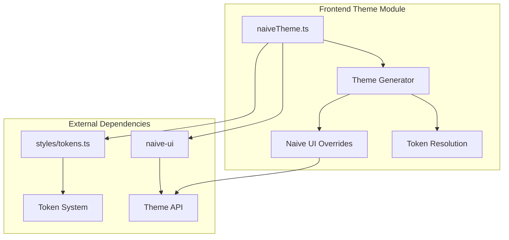

# 主题模块详细设计

## 架构设计

### 整体架构



### 数据流

1. **主题解析**: 应用主题 → 解析 Token → 生成覆盖
2. **主题应用**: 覆盖生成 → Naive UI 应用 → UI 更新
3. **主题切换**: 用户选择 → 主题切换 → 重新生成

## 数据结构

### 主题类型

```typescript
type ResolvedTheme = "dark" | "light"

interface AppTokens {
  background: string
  foreground: string
  primary: string
  secondary: string
  accent: string
  muted: string
  border: string
  ring: string
  radius: {
    sm: string
    md: string
    lg: string
  }
}
```

### 主题覆盖

```typescript
interface GlobalThemeOverrides {
  common: CommonThemeOverrides
  Button: ButtonThemeOverrides
  Input: InputThemeOverrides
  Card: CardThemeOverrides
  // ... 其他组件
}
```

## 算法逻辑

### Token 解析

1. **颜色解析**: 解析 oklch 颜色
2. **变量替换**: 替换 CSS 变量
3. **主题适配**: 适配深色/浅色主题
4. **缓存**: 缓存解析结果

### 覆盖生成

1. **通用样式**: 生成通用样式覆盖
2. **组件样式**: 生成组件样式覆盖
3. **字体设置**: 设置字体系列
4. **圆角设置**: 设置圆角大小

### 主题切换

1. **主题检测**: 检测系统主题
2. **手动切换**: 用户手动切换
3. **自动切换**: 跟随系统切换
4. **持久化**: 保存主题偏好

## 错误处理

### 主题错误

1. **Token 缺失**: 处理缺失的 Token
2. **解析错误**: 处理解析错误
3. **兼容性问题**: 处理兼容性问题

### 应用错误

1. **覆盖失败**: 处理覆盖失败
2. **组件不兼容**: 处理组件不兼容
3. **性能问题**: 处理性能问题

## 性能考虑

### 解析优化

1. **缓存**: 缓存解析结果
2. **批量解析**: 批量解析 Token
3. **延迟解析**: 按需解析
4. **索引**: 建立 Token 索引

### 应用优化

1. **增量更新**: 只更新变化的部分
2. **批量应用**: 合并多个应用操作
3. **异步应用**: 非阻塞应用
4. **缓存**: 缓存覆盖对象

## 测试策略

### 单元测试

1. **Token 解析测试**: 颜色解析
2. **覆盖生成测试**: 样式生成
3. **主题切换测试**: 切换逻辑

### 集成测试

1. **Naive UI 集成测试**: 主题应用
2. **系统主题测试**: 跟随系统
3. **持久化测试**: 主题保存

### 组件测试

1. **主题应用测试**: UI 组件
2. **颜色显示测试**: 颜色正确性
3. **响应式测试**: 主题切换响应

## 相关文件

- 前端: `src/modules/theme/`
- 样式: `src/styles/tokens.ts`
- UI: `naive-ui`