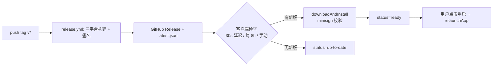

# Updater（应用内自动更新）

## 1. 概述

应用级自动更新能力：推送 `v*` 标签时 CI 构建三平台产物并生成 `latest.json`；已安装的客户端通过 Tauri updater 插件轮询该文件，发现新版本后自动下载安装（minisign 签名校验），等待用户重启生效。

## 2. 目录与文件

```
src/app/useAppUpdater.ts            # 更新控制器（检查/下载/进度/状态机）
src/app/useAppUpdater.test.ts
src/lib/native.ts                   # checkForAppUpdate / AppUpdate 包装（唯一插件出口）
src/settings/sections/AboutSection.vue  # 手动检查、自动开关、重启入口
.github/workflows/release.yml       # tag → 构建 → Release + latest.json
src-tauri/tauri.conf.json           # plugins.updater（endpoint + pubkey）、createUpdaterArtifacts
src-tauri/capabilities/default.json # updater:default 权限
```

## 3. 依赖

### 3.1 内部依赖

- `@/lib/native` -- 插件 JS API 的唯一出口（`process` 插件同款薄包装模式）
- `preferencesPinia` -- `autoCheckUpdates` 开关
- `@/lib/tauriRuntime` -- 非 Tauri 运行时降级为 no-op

### 3.2 外部依赖

- `tauri-plugin-updater`（Rust）+ `@tauri-apps/plugin-updater`（JS）-- 官方更新器
- `tauri-plugin-process` -- 更新就绪后 `relaunchApp()` 重启

## 4. 数据契约

### 4.1 公共类型

```ts
// native.ts —— 包装插件 Update，调用方不 import 插件包
type AppUpdate = {
  version: string;
  currentVersion: string;
  body: string | null;
  downloadAndInstall(onProgress?): Promise<void>;
};
type AppUpdateProgressEvent =
  | { event: "Started"; data: { contentLength?: number } }
  | { event: "Progress"; data: { chunkLength: number } }
  | { event: "Finished" };
```

### 4.2 Tauri 命令

无自建命令；全部经 updater 插件 IPC（`updater:default` 权限）。

### 4.3 事件

无；状态经 `useAppUpdater()` 单例的响应式状态共享。

## 5. Pinia 状态

无独立 store。更新状态机在 `createAppUpdaterController()` 工厂内，模块级单例
`useAppUpdater()` 供 MainApp（自动检查）与 AboutSection（手动检查）共享：
`status`（idle/checking/downloading/ready/up-to-date/error）、`availableVersion`、
`releaseNotes`、`downloadProgress`、`downloadedBytes`、`errorMessage`。

## 6. 关键算法 / 数据流



- 检查发现新版后**立即下载安装**（需求约定），不自动重启；重启时机交给用户。
- 静默检查失败不写 `errorMessage`（Linux deb/rpm 安装形态不支持 updater，避免每次启动报错）；手动检查失败则显示。

## 7. 配置项

- 偏好：`autoCheckUpdates`（`preferencesPinia`，默认开启；持久化 key `autoCheckUpdates`）
- 常量：`FIRST_CHECK_DELAY_MS = 30_000`、`RECHECK_INTERVAL_MS = 8h`
- endpoint：`https://github.com/xinggaoya/nexterm/releases/latest/download/latest.json`（`tauri.conf.json`）
- 签名：公钥在 `tauri.conf.json`；私钥经 GitHub Secrets `TAURI_SIGNING_PRIVATE_KEY` /
  `TAURI_SIGNING_PRIVATE_KEY_PASSWORD` 注入 CI（本地私钥在 `~/.tauri/nexterm.key`，**严禁入库**）

## 8. 测试

- `src/app/useAppUpdater.test.ts` -- 状态机、进度、静默/非静默错误、并发合并、调度与偏好、并发检查合并、非 Tauri 降级
- `src/settings/sections/AboutSection.test.ts` -- 设置页源码约束

## 9. 相关文档

- [发布流程](../../.github/workflows/release.yml)
- [02-module-contracts](../02-module-contracts.md) -- IPC 边界（插件 JS API 只能经 `native.ts`）
