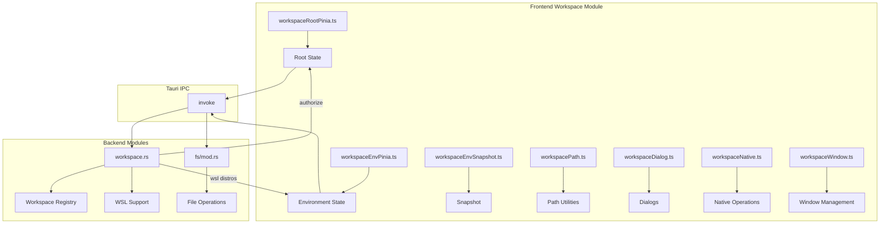

# 工作区模块详细设计

## 架构设计

### 整体架构



### 数据流

1. **工作区选择**: 用户选择 → 路径验证 → 环境检测
2. **环境切换**: WSL 选择 → 环境切换 → 路径转换
3. **状态持久化**: 保存工作区 → 持久化 → 恢复

## 数据结构

### 工作区环境

```typescript
type WorkspaceEnv = { kind: "local" } | { kind: "wsl"; distro: string }

interface WslDistro {
  name: string
  default: boolean
  running: boolean
}
```

### 存储的工作区

```typescript
interface StoredWorkspace {
  path: string
  env: WorkspaceEnv
  openedAt: number
}
```

### 工作区选择

```typescript
interface WorkspaceSelection {
  path: string
  env: WorkspaceEnv
}
```

## 算法逻辑

### 路径处理

1. **路径规范化**: 统一路径分隔符
2. **UNC 路径处理**: 处理 WSL UNC 路径
3. **相对路径转换**: 转换相对路径
4. **路径验证**: 验证路径有效性

### 环境检测

1. **WSL 检测**: 检测 WSL 环境
2. **发行版检测**: 检测可用发行版
3. **默认发行版**: 确定默认发行版
4. **状态监控**: 监控 WSL 状态

### 工作区授权

1. **路径验证**: 验证路径存在
2. **权限检查**: 检查访问权限
3. **注册授权**: 注册到后端
4. **缓存管理**: 管理授权缓存

## 错误处理

### 路径错误

1. **路径不存在**: 处理不存在的路径
2. **权限不足**: 处理权限问题
3. **路径无效**: 处理无效路径
4. **编码错误**: 处理编码问题

### 环境错误

1. **WSL 不可用**: 处理 WSL 不可用
2. **发行版错误**: 处理发行版问题
3. **网络错误**: 处理网络问题
4. **超时**: 处理操作超时

## 性能考虑

### 路径处理优化

1. **缓存**: 缓存路径转换
2. **批量处理**: 批量路径操作
3. **异步处理**: 非阻塞路径操作
4. **索引**: 建立路径索引

### 状态管理优化

1. **响应式**: 使用 Pinia 响应式
2. **延迟加载**: 按需加载状态
3. **选择性更新**: 只更新变化的部分
4. **批量更新**: 合并多个更新

## 测试策略

### 单元测试

1. **路径处理测试**: 路径转换
2. **环境检测测试**: WSL 检测
3. **状态管理测试**: Pinia store

### 集成测试

1. **工作区授权测试**: 真实路径
2. **WSL 集成测试**: WSL 操作
3. **窗口管理测试**: 多窗口

### 组件测试

1. **对话框渲染测试**: UI 组件
2. **交互测试**: 选择、切换
3. **状态同步测试**: 跨组件

## 相关文件

- 前端: `src/modules/workspace/`
- 后端: `src-tauri/src/modules/workspace.rs`
- 设置: `src/modules/settings/`